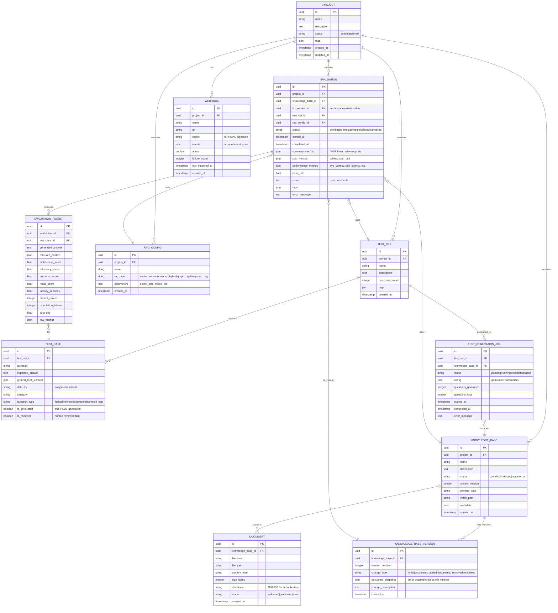

# RAG Evaluation Platform - Open Source Edition

## Executive Summary

Evoluzione della codebase `RAG-evaluator` in una piattaforma open source per la valutazione di sistemi RAG. Questa versione gratuita e destinata a sviluppatori individuali, ricercatori e piccole aziende che necessitano di valutare sistemi RAG su knowledge base aziendali.

L'approccio e **ibrido**: il codice esistente (`rag_evaluator` package) diventa una libreria core consumata da un nuovo layer applicativo (FastAPI backend + React frontend).

### Target Users

- **Sviluppatori individuali** che sviluppano e ottimizzano sistemi RAG
- **Ricercatori** che confrontano approcci RAG diversi
- **Piccole aziende** (< 10 utenti) che valutano soluzioni RAG interne
- **Studenti e accademici** per progetti di ricerca

### Obiettivi Open Source Edition

- Gestione multi-progetto con knowledge base e test set multipli
- **Generazione automatica test set** da knowledge base (LLM-based)
- **Progress tracking real-time** per valutazioni lunghe (SSE)
- Storicizzazione risultati con **versioning KB**
- **Trend analysis** basilare (senza regression detection statistica)
- Tracking costi e latenza
- Export **JSON e Markdown**
- **Webhook base** per integrazione CI/CD (max 3 per progetto)
- UI moderna per visualizzazione e gestione
- Containerizzazione Docker per deployment locale
- **Single-user mode** (nessuna autenticazione richiesta)

### Limitazioni Open Source Edition

| Feature | Open Source | Enterprise |
|---------|-------------|------------|
| Utenti | Single-user | Multi-tenant, teams |
| Autenticazione | Nessuna (locale) | OAuth2/OIDC, SSO |
| Webhooks | Max 3 per progetto | Illimitati |
| Export | JSON, Markdown | + Excel, PDF |
| Trend Analysis | Basilare | + Regression detection |
| RAG Esterni | No | Si (API endpoints) |
| Task Queue | In-process | Celery + Redis |
| Scheduled Evaluations | No | Si |
| Audit Logging | No | Si |
| Support | Community | Enterprise SLA |

### Tech Stack

| Layer | Tecnologia | Motivazione |
|-------|-----------|-------------|
| **Database** | PostgreSQL 16 | Open source, affidabile, JSON support |
| **Backend** | FastAPI + SQLAlchemy 2.0 | Async, type-safe, OpenAPI auto-docs |
| **Frontend** | React 18 + Vite + TanStack Query | Standard industry, ottimo per AI assistants |
| **Styling** | Tailwind CSS + shadcn/ui | Moderno, componenti pronti |
| **Streaming** | Server-Sent Events (SSE) | Progress tracking senza infra aggiuntiva |
| **Container** | Docker + Docker Compose | Portabilita, deployment semplice |

---

## Project Structure

```
RAG-evaluator/                          # Root del progetto (esistente)
|-- src/
|   +-- rag_evaluator/                  # [EXISTING] Libreria core (modifiche minori)
|       |-- common/
|       |   |-- base_rag.py             # [MODIFY] Rendere piu injectable
|       |   |-- token_tracker.py        # [NEW] Token usage tracking
|       |   +-- ...
|       |-- rag_implementations/        # [KEEP] 4 RAG implementations
|       |-- evaluation/                 # [KEEP] DeepEval evaluator
|       +-- ...
|
|-- platform/                           # [NEW] Piattaforma applicativa
|   |-- backend/
|   |   |-- app/
|   |   |   |-- __init__.py
|   |   |   |-- main.py                 # FastAPI app entrypoint
|   |   |   |-- config.py               # Settings con pydantic-settings
|   |   |   |-- database.py             # SQLAlchemy engine & session
|   |   |   |
|   |   |   |-- models/                 # SQLAlchemy ORM models
|   |   |   |   |-- __init__.py
|   |   |   |   |-- project.py
|   |   |   |   |-- knowledge_base.py
|   |   |   |   |-- knowledge_base_version.py
|   |   |   |   |-- document.py
|   |   |   |   |-- test_set.py
|   |   |   |   |-- test_case.py
|   |   |   |   |-- test_generation_job.py
|   |   |   |   |-- rag_config.py
|   |   |   |   |-- evaluation.py
|   |   |   |   |-- evaluation_result.py
|   |   |   |   +-- webhook.py
|   |   |   |
|   |   |   |-- schemas/                # Pydantic schemas (API DTOs)
|   |   |   |   |-- __init__.py
|   |   |   |   |-- project.py
|   |   |   |   |-- knowledge_base.py
|   |   |   |   |-- test_set.py
|   |   |   |   |-- rag_config.py
|   |   |   |   |-- evaluation.py
|   |   |   |   +-- webhook.py
|   |   |   |
|   |   |   |-- api/                    # API routes
|   |   |   |   |-- __init__.py
|   |   |   |   |-- deps.py             # Dependency injection
|   |   |   |   |-- projects.py
|   |   |   |   |-- knowledge_bases.py
|   |   |   |   |-- test_sets.py
|   |   |   |   |-- rag_configs.py
|   |   |   |   |-- evaluations.py      # Includes SSE stream endpoint
|   |   |   |   |-- comparisons.py
|   |   |   |   |-- trends.py           # Basic trend endpoints
|   |   |   |   +-- webhooks.py         # Limited webhook management
|   |   |   |
|   |   |   |-- services/               # Business logic
|   |   |   |   |-- __init__.py
|   |   |   |   |-- events.py           # Event definitions
|   |   |   |   |-- event_bus.py        # In-process event bus
|   |   |   |   |-- evaluation_service.py
|   |   |   |   |-- evaluation_runner.py
|   |   |   |   |-- test_generator_service.py
|   |   |   |   |-- trend_analysis_service.py  # Basic trends
|   |   |   |   |-- report_exporter.py         # JSON/Markdown only
|   |   |   |   |-- webhook_service.py         # Limited webhooks
|   |   |   |   |-- rag_adapter.py
|   |   |   |   |-- cost_tracker.py
|   |   |   |   +-- storage_service.py
|   |   |   |
|   |   |   +-- utils/
|   |   |       +-- pricing_defaults.py
|   |   |
|   |   |-- alembic/                    # Database migrations
|   |   |   |-- versions/
|   |   |   +-- env.py
|   |   |
|   |   |-- tests/
|   |   |   |-- conftest.py
|   |   |   |-- test_api/
|   |   |   +-- test_services/
|   |   |
|   |   |-- pyproject.toml
|   |   +-- Dockerfile
|   |
|   +-- frontend/
|       |-- src/
|       |   |-- main.tsx
|       |   |-- App.tsx
|       |   |-- api/
|       |   |-- components/
|       |   |   |-- ui/                 # shadcn/ui components
|       |   |   |-- layout/
|       |   |   |-- projects/
|       |   |   |-- knowledge-bases/
|       |   |   |-- test-sets/
|       |   |   |   +-- TestGeneratorWizard.tsx
|       |   |   |-- evaluations/
|       |   |   |   +-- EvaluationProgress.tsx
|       |   |   |-- comparisons/
|       |   |   +-- trends/
|       |   |       +-- TrendChart.tsx
|       |   |-- pages/
|       |   |   |-- Dashboard.tsx
|       |   |   |-- Projects.tsx
|       |   |   |-- ProjectDetail.tsx
|       |   |   |-- Evaluations.tsx
|       |   |   |-- EvaluationDetail.tsx
|       |   |   |-- Comparisons.tsx
|       |   |   |-- Trends.tsx
|       |   |   +-- TestSetGenerator.tsx
|       |   |-- hooks/
|       |   |   +-- useEvaluationStream.ts
|       |   +-- lib/
|       |
|       |-- package.json
|       |-- vite.config.ts
|       |-- tailwind.config.js
|       +-- Dockerfile
|
|-- docker/
|   |-- docker-compose.yml              # Full stack orchestration
|   |-- docker-compose.dev.yml          # Dev overrides
|   +-- init-db.sql                     # Initial DB setup
|
|-- storage/                            # File storage volume
|   |-- documents/
|   |-- indexes/
|   +-- reports/
|
|-- data/                               # [EXISTING] Legacy data
+-- docs/
    +-- api.md
```

---

## Database Schema (PostgreSQL)



### SQL Schema

```sql
-- Core tables
CREATE TABLE projects (
    id UUID PRIMARY KEY DEFAULT gen_random_uuid(),
    name VARCHAR(255) NOT NULL,
    description TEXT,
    status VARCHAR(20) DEFAULT 'active',
    tags JSONB DEFAULT '[]',
    created_at TIMESTAMP DEFAULT NOW(),
    updated_at TIMESTAMP DEFAULT NOW()
);

CREATE TABLE knowledge_bases (
    id UUID PRIMARY KEY DEFAULT gen_random_uuid(),
    project_id UUID REFERENCES projects(id) ON DELETE CASCADE,
    name VARCHAR(255) NOT NULL,
    description TEXT,
    status VARCHAR(50) DEFAULT 'pending',
    current_version INTEGER DEFAULT 0,
    storage_path VARCHAR(500),
    index_path VARCHAR(500),
    metadata JSONB DEFAULT '{}',
    created_at TIMESTAMP DEFAULT NOW()
);

CREATE TABLE knowledge_base_versions (
    id UUID PRIMARY KEY DEFAULT gen_random_uuid(),
    knowledge_base_id UUID REFERENCES knowledge_bases(id) ON DELETE CASCADE,
    version_number INTEGER NOT NULL,
    change_type VARCHAR(50) NOT NULL,
    document_snapshot JSONB DEFAULT '[]',
    change_description TEXT,
    created_at TIMESTAMP DEFAULT NOW(),
    UNIQUE(knowledge_base_id, version_number)
);

CREATE TABLE documents (
    id UUID PRIMARY KEY DEFAULT gen_random_uuid(),
    knowledge_base_id UUID REFERENCES knowledge_bases(id) ON DELETE CASCADE,
    filename VARCHAR(255) NOT NULL,
    file_path VARCHAR(500) NOT NULL,
    content_type VARCHAR(100),
    size_bytes INTEGER,
    checksum VARCHAR(64),
    status VARCHAR(50) DEFAULT 'uploaded',
    created_at TIMESTAMP DEFAULT NOW()
);

CREATE TABLE test_sets (
    id UUID PRIMARY KEY DEFAULT gen_random_uuid(),
    project_id UUID REFERENCES projects(id) ON DELETE CASCADE,
    name VARCHAR(255) NOT NULL,
    description TEXT,
    tags JSONB DEFAULT '[]',
    created_at TIMESTAMP DEFAULT NOW()
);

CREATE TABLE test_cases (
    id UUID PRIMARY KEY DEFAULT gen_random_uuid(),
    test_set_id UUID REFERENCES test_sets(id) ON DELETE CASCADE,
    question TEXT NOT NULL,
    expected_answer TEXT NOT NULL,
    ground_truth_context JSONB DEFAULT '[]',
    difficulty VARCHAR(20) DEFAULT 'medium',
    category VARCHAR(100),
    question_type VARCHAR(50) DEFAULT 'factual',
    is_generated BOOLEAN DEFAULT FALSE,
    is_reviewed BOOLEAN DEFAULT FALSE
);

CREATE TABLE test_generation_jobs (
    id UUID PRIMARY KEY DEFAULT gen_random_uuid(),
    test_set_id UUID REFERENCES test_sets(id) ON DELETE CASCADE,
    knowledge_base_id UUID REFERENCES knowledge_bases(id),
    status VARCHAR(50) DEFAULT 'pending',
    config JSONB DEFAULT '{}',
    questions_generated INTEGER DEFAULT 0,
    questions_total INTEGER DEFAULT 0,
    started_at TIMESTAMP,
    completed_at TIMESTAMP,
    error_message TEXT
);

CREATE TABLE rag_configs (
    id UUID PRIMARY KEY DEFAULT gen_random_uuid(),
    project_id UUID REFERENCES projects(id) ON DELETE CASCADE,
    name VARCHAR(255) NOT NULL,
    rag_type VARCHAR(50) NOT NULL,
    parameters JSONB DEFAULT '{}',
    created_at TIMESTAMP DEFAULT NOW()
);

CREATE TABLE evaluations (
    id UUID PRIMARY KEY DEFAULT gen_random_uuid(),
    project_id UUID REFERENCES projects(id) ON DELETE CASCADE,
    knowledge_base_id UUID REFERENCES knowledge_bases(id),
    kb_version_id UUID REFERENCES knowledge_base_versions(id),
    test_set_id UUID REFERENCES test_sets(id),
    rag_config_id UUID REFERENCES rag_configs(id),
    status VARCHAR(50) DEFAULT 'pending',
    started_at TIMESTAMP,
    completed_at TIMESTAMP,
    summary_metrics JSONB,
    cost_metrics JSONB,
    performance_metrics JSONB,
    pass_rate FLOAT,
    notes TEXT,
    tags JSONB DEFAULT '[]',
    error_message TEXT
);

CREATE TABLE evaluation_results (
    id UUID PRIMARY KEY DEFAULT gen_random_uuid(),
    evaluation_id UUID REFERENCES evaluations(id) ON DELETE CASCADE,
    test_case_id UUID REFERENCES test_cases(id),
    generated_answer TEXT,
    retrieved_context JSONB,
    faithfulness_score FLOAT,
    relevancy_score FLOAT,
    precision_score FLOAT,
    recall_score FLOAT,
    latency_seconds FLOAT,
    prompt_tokens INTEGER,
    completion_tokens INTEGER,
    cost_usd DECIMAL(10, 6),
    raw_metrics JSONB
);

CREATE TABLE webhooks (
    id UUID PRIMARY KEY DEFAULT gen_random_uuid(),
    project_id UUID REFERENCES projects(id) ON DELETE CASCADE,
    name VARCHAR(255) NOT NULL,
    url VARCHAR(500) NOT NULL,
    secret VARCHAR(255),
    events JSONB DEFAULT '[]',
    active BOOLEAN DEFAULT TRUE,
    failure_count INTEGER DEFAULT 0,
    last_triggered_at TIMESTAMP,
    created_at TIMESTAMP DEFAULT NOW()
);

-- Indexes for common queries
CREATE INDEX idx_kb_project ON knowledge_bases(project_id);
CREATE INDEX idx_kb_status ON knowledge_bases(status);
CREATE INDEX idx_kb_versions ON knowledge_base_versions(knowledge_base_id, version_number);
CREATE INDEX idx_docs_kb ON documents(knowledge_base_id);
CREATE INDEX idx_test_cases_set ON test_cases(test_set_id);
CREATE INDEX idx_eval_project ON evaluations(project_id);
CREATE INDEX idx_eval_status ON evaluations(status);
CREATE INDEX idx_eval_rag_config ON evaluations(rag_config_id);
CREATE INDEX idx_eval_completed ON evaluations(completed_at);
CREATE INDEX idx_results_eval ON evaluation_results(evaluation_id);
CREATE INDEX idx_webhooks_project ON webhooks(project_id);
```

---

## API Endpoints

### Projects

| Method | Endpoint | Description |
|--------|----------|-------------|
| GET | `/api/v1/projects` | List all projects (supports ?status=, ?tags=) |
| POST | `/api/v1/projects` | Create project |
| GET | `/api/v1/projects/{id}` | Get project details |
| PUT | `/api/v1/projects/{id}` | Update project |
| DELETE | `/api/v1/projects/{id}` | Delete project (cascade) |
| POST | `/api/v1/projects/{id}/archive` | Archive project |

### Knowledge Bases

| Method | Endpoint | Description |
|--------|----------|-------------|
| GET | `/api/v1/projects/{pid}/knowledge-bases` | List KBs in project |
| POST | `/api/v1/projects/{pid}/knowledge-bases` | Create KB |
| GET | `/api/v1/knowledge-bases/{id}` | Get KB details |
| DELETE | `/api/v1/knowledge-bases/{id}` | Delete KB |
| POST | `/api/v1/knowledge-bases/{id}/documents` | Upload documents |
| DELETE | `/api/v1/knowledge-bases/{id}/documents/{docId}` | Remove document |
| POST | `/api/v1/knowledge-bases/{id}/index` | Trigger indexing |
| GET | `/api/v1/knowledge-bases/{id}/status` | Get indexing status |
| GET | `/api/v1/knowledge-bases/{id}/versions` | List KB versions |

### Test Sets

| Method | Endpoint | Description |
|--------|----------|-------------|
| GET | `/api/v1/projects/{pid}/test-sets` | List test sets |
| POST | `/api/v1/projects/{pid}/test-sets` | Create test set |
| GET | `/api/v1/test-sets/{id}` | Get test set with cases |
| PUT | `/api/v1/test-sets/{id}` | Update test set |
| DELETE | `/api/v1/test-sets/{id}` | Delete test set |
| POST | `/api/v1/test-sets/{id}/cases` | Add test case |
| PUT | `/api/v1/test-sets/{id}/cases/{caseId}` | Update test case |
| DELETE | `/api/v1/test-sets/{id}/cases/{caseId}` | Delete test case |
| POST | `/api/v1/test-sets/{id}/import` | Import from JSON |
| GET | `/api/v1/test-sets/{id}/export` | Export to JSON |
| POST | `/api/v1/test-sets/{id}/generate` | Generate test cases from KB |
| GET | `/api/v1/test-sets/{id}/generation-status` | Get generation progress |
| POST | `/api/v1/test-sets/{id}/cases/bulk-review` | Bulk approve/reject generated cases |

### RAG Configs

| Method | Endpoint | Description |
|--------|----------|-------------|
| GET | `/api/v1/projects/{pid}/rag-configs` | List RAG configs |
| POST | `/api/v1/projects/{pid}/rag-configs` | Create RAG config |
| GET | `/api/v1/rag-configs/{id}` | Get config details |
| PUT | `/api/v1/rag-configs/{id}` | Update config |
| DELETE | `/api/v1/rag-configs/{id}` | Delete config |
| GET | `/api/v1/rag-types` | List available RAG types |
| GET | `/api/v1/rag-types/{type}/parameters` | Get config schema for type |

### Evaluations

| Method | Endpoint | Description |
|--------|----------|-------------|
| GET | `/api/v1/projects/{pid}/evaluations` | List evaluations (supports filters) |
| POST | `/api/v1/evaluations` | Start new evaluation |
| GET | `/api/v1/evaluations/{id}` | Get evaluation details |
| GET | `/api/v1/evaluations/{id}/results` | Get detailed results (paginated) |
| GET | `/api/v1/evaluations/{id}/stream` | SSE stream for progress |
| POST | `/api/v1/evaluations/{id}/cancel` | Cancel running evaluation |
| POST | `/api/v1/evaluations/{id}/retry` | Retry failed evaluation |
| GET | `/api/v1/evaluations/{id}/report` | Download report (?format=json|markdown) |
| PUT | `/api/v1/evaluations/{id}/notes` | Update evaluation notes |
| DELETE | `/api/v1/evaluations/{id}` | Delete evaluation |

### Comparisons

| Method | Endpoint | Description |
|--------|----------|-------------|
| POST | `/api/v1/comparisons` | Compare multiple evaluations |
| GET | `/api/v1/comparisons/{id}` | Get comparison results |
| GET | `/api/v1/projects/{pid}/comparisons` | List saved comparisons |

### Trends (Basic)

| Method | Endpoint | Description |
|--------|----------|-------------|
| GET | `/api/v1/projects/{pid}/trends` | Performance trends over time |
| GET | `/api/v1/rag-configs/{id}/trends` | Trends for specific RAG config |

### Webhooks (Limited - Max 3 per project)

| Method | Endpoint | Description |
|--------|----------|-------------|
| GET | `/api/v1/projects/{pid}/webhooks` | List webhooks |
| POST | `/api/v1/projects/{pid}/webhooks` | Create webhook (max 3) |
| GET | `/api/v1/webhooks/{id}` | Get webhook details |
| PUT | `/api/v1/webhooks/{id}` | Update webhook |
| DELETE | `/api/v1/webhooks/{id}` | Delete webhook |
| POST | `/api/v1/webhooks/{id}/test` | Send test event |

### System

| Method | Endpoint | Description |
|--------|----------|-------------|
| GET | `/api/v1/health` | Health check |
| GET | `/api/v1/stats` | System-wide statistics |

---

## Modifications to Existing Library

### [MODIFY] `src/rag_evaluator/common/base_rag.py`

Rendere la classe piu "injectable" per configurazione dinamica:

```python
# BEFORE (current)
class BaseRAG(ABC):
    def __init__(self, name: str) -> None:
        self.name = name

# AFTER (proposed)
from dataclasses import dataclass, field
from typing import Any, Callable

@dataclass
class RAGConfig:
    """Configuration container for RAG implementations."""
    name: str
    parameters: dict[str, Any] = field(default_factory=dict)
    storage_path: str = "./data/indexes"

class BaseRAG(ABC):
    def __init__(self, config: RAGConfig) -> None:
        self.config = config
        self.name = config.name
        self._metrics: dict[str, Any] = {}
        self._token_usage: TokenUsage = TokenUsage()
        self._progress_callback: Callable[[int, int], None] | None = None

    def set_progress_callback(self, callback: Callable[[int, int], None]) -> None:
        """Set callback for progress reporting during long operations."""
        self._progress_callback = callback

    @abstractmethod
    def prepare_documents(self, documents_path: str) -> None:
        """Prepare and index documents for retrieval."""
        pass

    @abstractmethod
    def query(self, question: str, top_k: int = 5) -> dict[str, Any]:
        """Query the RAG system.

        Returns dict with: answer, context, metadata (including token counts)
        """
        pass

    @abstractmethod
    def get_metrics(self) -> dict[str, Any]:
        """Get performance metrics including token usage."""
        pass

    def get_token_usage(self) -> "TokenUsage":
        """Return token usage from last query."""
        return self._token_usage

    def reset_token_usage(self) -> None:
        """Reset token usage counters."""
        self._token_usage = TokenUsage()
```

### [NEW] `src/rag_evaluator/common/token_tracker.py`

```python
"""Token usage tracking utilities."""
from dataclasses import dataclass

@dataclass
class TokenUsage:
    """Track token usage for cost calculation."""
    prompt_tokens: int = 0
    completion_tokens: int = 0
    embedding_tokens: int = 0

    @property
    def total_tokens(self) -> int:
        return self.prompt_tokens + self.completion_tokens + self.embedding_tokens

    def add(self, other: "TokenUsage") -> "TokenUsage":
        """Add another TokenUsage to this one."""
        return TokenUsage(
            prompt_tokens=self.prompt_tokens + other.prompt_tokens,
            completion_tokens=self.completion_tokens + other.completion_tokens,
            embedding_tokens=self.embedding_tokens + other.embedding_tokens,
        )

    def to_dict(self) -> dict[str, int]:
        return {
            "prompt_tokens": self.prompt_tokens,
            "completion_tokens": self.completion_tokens,
            "embedding_tokens": self.embedding_tokens,
            "total_tokens": self.total_tokens,
        }
```

---

## Key Services Implementation

### Event Bus (In-Process)

```python
# platform/backend/app/services/event_bus.py
"""In-process event bus for Open Source edition."""

from collections import defaultdict
from typing import Callable, Any
import asyncio
from contextlib import asynccontextmanager

class EventBus:
    """Simple in-process async event bus."""

    def __init__(self):
        self._handlers: dict[str, list[Callable]] = defaultdict(list)
        self._streams: dict[str, list[asyncio.Queue]] = defaultdict(list)

    def subscribe(self, event_type: str, handler: Callable) -> None:
        """Subscribe a handler to an event type."""
        self._handlers[event_type].append(handler)

    async def publish(self, event_type: str, data: dict[str, Any]) -> None:
        """Publish an event to all handlers and streams."""
        for handler in self._handlers[event_type]:
            try:
                if asyncio.iscoroutinefunction(handler):
                    await handler(data)
                else:
                    handler(data)
            except Exception as e:
                print(f"Handler error for {event_type}: {e}")

        for queue in self._streams.get(event_type, []):
            await queue.put(data)

    @asynccontextmanager
    async def stream(self, event_type: str):
        """Create a stream for SSE consumption."""
        queue: asyncio.Queue = asyncio.Queue()
        self._streams[event_type].append(queue)
        try:
            yield queue
        finally:
            self._streams[event_type].remove(queue)

event_bus = EventBus()
```

### Test Generator Service

```python
# platform/backend/app/services/test_generator_service.py
"""LLM-based test set generation from knowledge base documents."""

from dataclasses import dataclass, field
from enum import Enum
from typing import AsyncGenerator
import uuid

class QuestionType(str, Enum):
    FACTUAL = "factual"
    INFERENTIAL = "inferential"
    COMPARATIVE = "comparative"
    MULTI_HOP = "multi_hop"

class Difficulty(str, Enum):
    EASY = "easy"
    MEDIUM = "medium"
    HARD = "hard"

@dataclass
class GenerationConfig:
    """Configuration for test case generation."""
    questions_per_document: int = 5
    difficulty_distribution: dict[str, float] = field(
        default_factory=lambda: {"easy": 0.3, "medium": 0.5, "hard": 0.2}
    )
    question_types: list[QuestionType] = field(
        default_factory=lambda: list(QuestionType)
    )
    language: str = "en"
    model: str = "gpt-4o-mini"

@dataclass
class GeneratedTestCase:
    """A generated test case pending review."""
    id: str
    question: str
    expected_answer: str
    ground_truth_context: list[str]
    difficulty: Difficulty
    question_type: QuestionType
    source_document: str
    confidence_score: float

class TestGeneratorService:
    """Generate test cases from knowledge base documents using LLM."""

    def __init__(self, llm_client, db_session):
        self.llm = llm_client
        self.db = db_session

    async def generate_from_kb(
        self,
        knowledge_base_id: str,
        test_set_id: str,
        config: GenerationConfig,
    ) -> AsyncGenerator[GeneratedTestCase, None]:
        """Generate test cases from all documents in a knowledge base."""
        chunks = await self._load_kb_chunks(knowledge_base_id)

        for chunk in chunks:
            questions = await self._generate_questions_for_chunk(chunk, config)

            for q in questions:
                answer = await self._generate_answer(q, chunk)

                test_case = GeneratedTestCase(
                    id=str(uuid.uuid4()),
                    question=q["question"],
                    expected_answer=answer["answer"],
                    ground_truth_context=[chunk.content],
                    difficulty=q["difficulty"],
                    question_type=q["type"],
                    source_document=chunk.document_name,
                    confidence_score=answer["confidence"],
                )

                yield test_case
```

### Basic Trend Analysis Service

```python
# platform/backend/app/services/trend_analysis_service.py
"""Basic trend analysis for Open Source edition."""

from dataclasses import dataclass
from typing import Optional
import numpy as np

@dataclass
class TrendPoint:
    date: str
    value: float
    evaluation_count: int

@dataclass
class TrendData:
    metric: str
    points: list[TrendPoint]
    trend_direction: str  # "improving", "declining", "stable"
    change_percent: float

class TrendAnalysisService:
    """Basic performance trend analysis."""

    def __init__(self, db_session):
        self.db = db_session

    async def get_trends(
        self,
        project_id: str,
        rag_config_id: Optional[str] = None,
        days: int = 30,
        metrics: list[str] = None,
    ) -> list[TrendData]:
        """Get performance trends over time."""
        if metrics is None:
            metrics = ["faithfulness", "answer_relevancy", "contextual_precision", "contextual_recall", "pass_rate"]

        # Query evaluations for the period
        raw_data = await self._query_evaluation_data(
            project_id, rag_config_id, days
        )

        trends = []
        for metric in metrics:
            points = self._extract_metric_points(raw_data, metric)
            trend_dir, change_pct = self._calculate_trend(points)

            trends.append(TrendData(
                metric=metric,
                points=points,
                trend_direction=trend_dir,
                change_percent=change_pct,
            ))

        return trends

    def _calculate_trend(self, points: list[TrendPoint]) -> tuple[str, float]:
        """Calculate trend direction and overall change."""
        if len(points) < 2:
            return "stable", 0.0

        values = [p.value for p in points]
        first_avg = np.mean(values[:len(values)//3]) if len(values) >= 3 else values[0]
        last_avg = np.mean(values[-len(values)//3:]) if len(values) >= 3 else values[-1]

        if first_avg == 0:
            return "stable", 0.0

        change_pct = ((last_avg - first_avg) / first_avg) * 100

        if change_pct > 5:
            return "improving", change_pct
        elif change_pct < -5:
            return "declining", change_pct
        else:
            return "stable", change_pct
```

### Report Exporter Service (JSON/Markdown only)

```python
# platform/backend/app/services/report_exporter.py
"""Report export service - JSON and Markdown for Open Source edition."""

from enum import Enum
from typing import BinaryIO
import json
from io import BytesIO

class ReportFormat(str, Enum):
    JSON = "json"
    MARKDOWN = "markdown"

class ReportExporterService:
    """Export evaluation reports in JSON and Markdown formats."""

    async def export(
        self,
        evaluation_id: str,
        format: ReportFormat,
    ) -> tuple[BinaryIO, str, str]:
        """Export evaluation report.

        Returns: (file_content, filename, content_type)
        """
        evaluation = await self._load_evaluation(evaluation_id)

        if format == ReportFormat.JSON:
            return self._export_json(evaluation)
        elif format == ReportFormat.MARKDOWN:
            return self._export_markdown(evaluation)

    def _export_json(self, evaluation) -> tuple[BinaryIO, str, str]:
        """Export as JSON."""
        data = evaluation.to_dict()
        content = json.dumps(data, indent=2, default=str)

        buffer = BytesIO(content.encode('utf-8'))
        filename = f"evaluation_{evaluation.id}_{evaluation.timestamp}.json"

        return buffer, filename, "application/json"

    def _export_markdown(self, evaluation) -> tuple[BinaryIO, str, str]:
        """Export as Markdown report."""
        md = self._generate_markdown_report(evaluation)

        buffer = BytesIO(md.encode('utf-8'))
        filename = f"evaluation_{evaluation.id}_{evaluation.timestamp}.md"

        return buffer, filename, "text/markdown"
```

---

## Frontend Pages

### 1. Dashboard (`/`)

```
+------------------------------------------------------------------+
|  [Logo] RAG Evaluation Platform (Open Source)                     |
+------------------------------------------------------------------+
|                                                                    |
|  Quick Stats:                                                      |
|  +------------+ +------------+ +------------+ +------------+       |
|  | Projects   | | KBs        | | Test Sets  | | Evaluations|       |
|  |     5      | |     8      | |     12     | |     34     |       |
|  +------------+ +------------+ +------------+ +------------+       |
|                                                                    |
|  +---------------------------+  +-----------------------------+    |
|  | Recent Activity           |  | Performance Trend (30d)     |    |
|  | - Eval completed: Proj A  |  |  [Line chart: pass rate]    |    |
|  | - KB indexed: Proj B      |  |                             |    |
|  | - Test set created        |  +-----------------------------+    |
|  +---------------------------+                                     |
|                                                                    |
|  +---------------------------+                                     |
|  | Quick Actions             |                                     |
|  | [+ New Project]           |                                     |
|  | [Upload Documents]        |                                     |
|  | [Run Evaluation]          |                                     |
|  | [Generate Test Set]       |                                     |
|  +---------------------------+                                     |
|                                                                    |
+------------------------------------------------------------------+
```

### 2. Evaluation Detail (`/evaluations/{id}`)

```
+------------------------------------------------------------------+
| Evaluation: eval_abc123                    Status: [Running 67%]  |
+------------------------------------------------------------------+
| Progress: [=========>                    ] 67/100 test cases      |
| Elapsed: 4m 32s | Est. remaining: 2m 15s                         |
+------------------------------------------------------------------+

[After completion:]

+------------------------------------------------------------------+
| Summary Metrics                                                   |
| +----------+ +----------+ +----------+ +----------+              |
| |Faithful  | |Relevancy | |Precision | |Recall    |              |
| |  0.85    | |  0.82    | |  0.78    | |  0.75    |              |
| +----------+ +----------+ +----------+ +----------+              |
|                                                                   |
| Pass Rate: 78.5%  |  Avg Latency: 1.2s  |  Total Cost: $2.34     |
+------------------------------------------------------------------+
| [Export JSON] [Export Markdown]                                   |
+------------------------------------------------------------------+

| Results by Difficulty:                                            |
| Easy (30):   [============================] 92%                   |
| Medium (50): [=====================       ] 76%                   |
| Hard (20):   [===============             ] 58%                   |
+------------------------------------------------------------------+
```

### 3. Trends Page (`/projects/{id}/trends`)

```
+------------------------------------------------------------------+
| Performance Trends - Project Alpha                                |
+------------------------------------------------------------------+
| Time Range: [Last 30 days v]  RAG Config: [All v]                |
+------------------------------------------------------------------+
|                                                                   |
| [Line chart: All metrics over time]                              |
|                                                                   |
+------------------------------------------------------------------+
| Summary:                                                          |
| Metric      | Current | 30d Avg | Trend                          |
| Faithfulness| 0.82    | 0.80    | Improving (+2.5%)              |
| Relevancy   | 0.79    | 0.81    | Declining (-2.5%)              |
| ...                                                               |
+------------------------------------------------------------------+
```

---

## Docker Setup

### `docker/docker-compose.yml`

```yaml
version: "3.9"

services:
  db:
    image: postgres:16-alpine
    environment:
      POSTGRES_USER: rageval
      POSTGRES_PASSWORD: ${DB_PASSWORD:-rageval_secret}
      POSTGRES_DB: rageval
    volumes:
      - postgres_data:/var/lib/postgresql/data
      - ./init-db.sql:/docker-entrypoint-initdb.d/init.sql
    ports:
      - "5432:5432"
    healthcheck:
      test: ["CMD-SHELL", "pg_isready -U rageval"]
      interval: 5s
      timeout: 5s
      retries: 5

  backend:
    build:
      context: ../
      dockerfile: platform/backend/Dockerfile
    environment:
      DATABASE_URL: postgresql+asyncpg://rageval:${DB_PASSWORD:-rageval_secret}@db:5432/rageval
      OPENAI_API_KEY: ${OPENAI_API_KEY}
      STORAGE_PATH: /app/storage
      LOG_LEVEL: ${LOG_LEVEL:-INFO}
    volumes:
      - ../storage:/app/storage
    ports:
      - "8000:8000"
    depends_on:
      db:
        condition: service_healthy
    healthcheck:
      test: ["CMD", "curl", "-f", "http://localhost:8000/api/v1/health"]
      interval: 10s
      timeout: 5s
      retries: 3

  frontend:
    build:
      context: ../platform/frontend
      dockerfile: Dockerfile
      args:
        VITE_API_URL: ${API_URL:-http://localhost:8000}
    ports:
      - "3000:80"
    depends_on:
      - backend

  # Optional: Qdrant for hybrid search
  qdrant:
    image: qdrant/qdrant:latest
    ports:
      - "6333:6333"
    volumes:
      - qdrant_data:/qdrant/storage
    profiles:
      - hybrid

  # Optional: Neo4j for graph RAG
  neo4j:
    image: neo4j:5-community
    environment:
      NEO4J_AUTH: neo4j/${NEO4J_PASSWORD:-neo4j_secret}
      NEO4J_PLUGINS: '["apoc"]'
    ports:
      - "7474:7474"
      - "7687:7687"
    volumes:
      - neo4j_data:/data
    profiles:
      - graph

volumes:
  postgres_data:
  qdrant_data:
  neo4j_data:
```

---

## Implementation Phases

### Phase 1: Foundation (Week 1-2)

- [ ] Setup project structure (`platform/backend`, `platform/frontend`)
- [ ] PostgreSQL schema + Alembic migrations
- [ ] FastAPI skeleton with health endpoint
- [ ] SQLAlchemy models (all tables)
- [ ] React + Vite + Tailwind + shadcn/ui setup
- [ ] Docker Compose base configuration
- [ ] Event bus infrastructure (in-process)
- [ ] Basic error handling and structured logging

**Deliverables:**
- Working backend skeleton with DB connection
- Working frontend skeleton with routing
- Docker Compose for local development

### Phase 2: Core CRUD + Storage (Week 3-4)

- [ ] Projects API + UI pages (list, detail, create, archive)
- [ ] Knowledge Bases API + document upload + versioning
- [ ] File storage service abstraction
- [ ] Test Sets API + import/export JSON
- [ ] Test Cases CRUD
- [ ] RAG Configs API (built-in types only)
- [ ] Basic search functionality

**Deliverables:**
- Full CRUD for all core entities
- Document upload with validation
- KB versioning working
- Test set import/export

### Phase 3: Evaluation Engine + Progress (Week 5-6)

- [ ] Modify `base_rag.py` for injectable config
- [ ] Create `rag_adapter.py` service
- [ ] Implement evaluation runner with event emission
- [ ] SSE endpoint for progress streaming
- [ ] Frontend progress component
- [ ] Token tracking per query
- [ ] Cost calculation service
- [ ] Store results in DB
- [ ] Cancel/retry evaluation support

**Deliverables:**
- Working evaluation pipeline
- Real-time progress in UI
- Cost tracking per evaluation

### Phase 4: Test Generation (Week 7-8)

- [ ] Test generation service (LLM-based)
- [ ] Generation progress tracking
- [ ] Human review/edit workflow in UI
- [ ] Bulk approve/reject
- [ ] Difficulty auto-classification

**Deliverables:**
- Working test generation from KB
- Review workflow in UI

### Phase 5: Results, Trends & Export (Week 9-10)

- [ ] Evaluation detail page with full metrics
- [ ] Cost/latency breakdown display
- [ ] Comparison view (2+ evaluations)
- [ ] Basic trend analysis service
- [ ] Trend visualization (charts)
- [ ] Export: JSON, Markdown

**Deliverables:**
- Rich evaluation detail page
- Trend charts
- Multi-format export working

### Phase 6: Polish & Documentation (Week 11-12)

- [ ] Limited webhook system (max 3 per project)
- [ ] Comprehensive error handling
- [ ] Loading states across all pages
- [ ] Empty states and onboarding hints
- [ ] Dashboard with stats
- [ ] Documentation (README, API docs, deployment guide)
- [ ] Production Docker build
- [ ] End-to-end testing

**Deliverables:**
- Basic webhook integration
- Polished UI
- Complete documentation
- Production-ready Docker images

---

## Verification Plan

### Automated Tests

```bash
# Backend tests
cd platform/backend && uv run pytest tests/ -v --cov=app

# Frontend tests
cd platform/frontend && npm run test

# E2E tests
npm run test:e2e
```

### Manual Verification Checklist

1. Create Project
2. Create Knowledge Base + Upload 5 documents
3. Verify KB versioning works
4. Generate Test Set from KB (20 questions)
5. Review and approve generated questions
6. Create RAG Config (vector_semantic)
7. Run Evaluation
8. Verify progress streaming works
9. View results, export JSON and Markdown
10. Run second evaluation, compare

---

## Migration Strategy (Existing Data)

Script per migrare dati esistenti:

```bash
uv run python scripts/migrate_legacy.py --project-name "Migrated Data"
```

---

## License

This Open Source edition is licensed under the **MIT License**.

For enterprise features (multi-tenant, authentication, advanced analytics), see **EVOLUTION_PLAN_ENTERPRISE.md**.

---

**Document Version:** 1.0
**Last Updated:** 2026-01-09
**Status:** Draft - Open Source Edition
