# RAG Evaluation Platform - Open Source Edition v2.0

## Executive Summary

Evolution of the existing `RAG-evaluator` codebase into an open source platform for evaluating RAG systems. This free version is designed for individual developers, researchers, and small companies that need to evaluate RAG systems on corporate knowledge bases.

The approach is **hybrid**: the existing code (`rag_evaluator` package) becomes a core library consumed by a new application layer (FastAPI backend + React frontend).

### Target Users

- **Individual developers** developing and optimizing RAG systems
- **Researchers** comparing different RAG approaches
- **Small companies** (< 10 users) evaluating internal RAG solutions
- **Students and academics** for research projects

### Open Source Edition Goals

- Multi-project management with multiple knowledge bases and test sets
- **Automatic test set generation** from knowledge base (LLM-based) with quality gates
- **Real-time progress tracking** for long evaluations (SSE)
- **Resumable evaluations** with checkpoints (restart-safe)
- Result historization with **KB versioning**
- **Reproducibility controls** with run manifests
- **Basic trend analysis** (without statistical regression detection)
- Cost and latency tracking
- **Metric explainability** - show judge reasoning, not just scores
- **Evaluation baselines** for regression detection
- **JSON and Markdown** export
- **Basic webhooks** for CI/CD integration (max 3 per project) with signature verification
- Modern UI for visualization and management
- Docker containerization for local deployment
- **Single-user mode** (no authentication required)
- **Multi-provider LLM support** (OpenAI, Ollama, Anthropic via LiteLLM)
- **SQLite for dev** + PostgreSQL for production

### Open Source Edition Limitations

| Feature | Open Source | Enterprise |
|---------|-------------|------------|
| Users | Single-user | Multi-tenant, teams |
| Authentication | None (local) | OAuth2/OIDC, SSO |
| Webhooks | Max 3 per project | Unlimited |
| Export | JSON, Markdown | + Excel, PDF |
| Trend Analysis | Basic | + Regression detection |
| External RAGs | No | Yes (API endpoints) |
| Task Queue | In-process (resumable) | Celery + Redis |
| Scheduled Evaluations | No | Yes |
| Audit Logging | Basic | Full |
| Support | Community | Enterprise SLA |

### Tech Stack

| Layer | Technology | Rationale |
|-------|-----------|-----------|
| **Database** | PostgreSQL 16 (default) + SQLite (dev) | Postgres for robustness; SQLite for zero-setup local usage |
| **Backend** | FastAPI + SQLAlchemy 2.0 | Async, type-safe, OpenAPI auto-docs |
| **Frontend** | React 18 + Vite + TanStack Query | Industry standard, great for AI assistants |
| **Styling** | Tailwind CSS + shadcn/ui | Modern, ready-made components |
| **Streaming** | Server-Sent Events (SSE) | Progress tracking without extra infrastructure |
| **Container** | Docker + Docker Compose | Portability, simple deployment |
| **LLM Client** | LiteLLM | Unified interface for OpenAI, Ollama, Anthropic, local models |
| **Logging** | Structlog | JSON structured logging with correlation IDs |

---

## Project Structure

```
RAG-evaluator/                          # Project root (existing)
|-- src/
|   +-- rag_evaluator/                  # [EXISTING] Core library (modifications)
|       |-- common/
|       |   |-- base_rag.py             # [MODIFY] Add retrieve/generate separation
|       |   |-- provider_interfaces.py  # [NEW] RAG, LLM, Embedding provider contracts
|       |   |-- token_tracker.py        # [NEW] Token usage tracking
|       |   |-- retrieval_trace.py      # [NEW] Standardized trace schema
|       |   +-- ...
|       |-- rag_implementations/        # [KEEP] 4 RAG implementations
|       |-- evaluation/                 # [KEEP] DeepEval evaluator
|       +-- ...
|
|-- platform/                           # [NEW] Application platform
|   |-- backend/
|   |   |-- app/
|   |   |   |-- __init__.py
|   |   |   |-- main.py                 # FastAPI app entrypoint
|   |   |   |-- config.py               # Settings with pydantic-settings
|   |   |   |-- database.py             # SQLAlchemy engine & session
|   |   |   |
|   |   |   |-- models/                 # SQLAlchemy ORM models
|   |   |   |   |-- __init__.py
|   |   |   |   |-- project.py
|   |   |   |   |-- knowledge_base.py
|   |   |   |   |-- knowledge_base_version.py
|   |   |   |   |-- document.py
|   |   |   |   |-- test_set.py
|   |   |   |   |-- test_case.py
|   |   |   |   |-- test_template.py    # [NEW] Pre-built test templates
|   |   |   |   |-- test_generation_job.py
|   |   |   |   |-- rag_config.py
|   |   |   |   |-- evaluation.py
|   |   |   |   |-- evaluation_result.py
|   |   |   |   |-- evaluation_job.py   # [NEW] Resumable job state
|   |   |   |   |-- artifact.py         # [NEW] Content-addressed artifacts
|   |   |   |   |-- run_manifest.py     # [NEW] Reproducibility snapshot
|   |   |   |   +-- webhook.py
|   |   |   |
|   |   |   |-- schemas/                # Pydantic schemas (API DTOs)
|   |   |   |   |-- __init__.py
|   |   |   |   |-- project.py
|   |   |   |   |-- knowledge_base.py
|   |   |   |   |-- test_set.py
|   |   |   |   |-- rag_config.py
|   |   |   |   |-- evaluation.py
|   |   |   |   +-- webhook.py
|   |   |   |
|   |   |   |-- api/                    # API routes
|   |   |   |   |-- __init__.py
|   |   |   |   |-- deps.py             # Dependency injection
|   |   |   |   |-- projects.py
|   |   |   |   |-- knowledge_bases.py
|   |   |   |   |-- test_sets.py
|   |   |   |   |-- test_templates.py   # [NEW] Template management
|   |   |   |   |-- rag_configs.py
|   |   |   |   |-- evaluations.py      # Includes SSE stream endpoint
|   |   |   |   |-- comparisons.py
|   |   |   |   |-- trends.py           # Basic trend endpoints
|   |   |   |   +-- webhooks.py         # Limited webhook management
|   |   |   |
|   |   |   |-- services/               # Business logic
|   |   |   |   |-- __init__.py
|   |   |   |   |-- events.py           # Event definitions
|   |   |   |   |-- job_event_log.py    # [MODIFIED] Persisted event log
|   |   |   |   |-- evaluation_service.py
|   |   |   |   |-- evaluation_runner.py
|   |   |   |   |-- job_checkpoint_service.py  # [NEW] Checkpoint management
|   |   |   |   |-- test_generator_service.py
|   |   |   |   |-- test_quality_gate.py       # [NEW] Quality validation
|   |   |   |   |-- trend_analysis_service.py  # Basic trends
|   |   |   |   |-- report_exporter.py         # JSON/Markdown only
|   |   |   |   |-- webhook_service.py         # Limited webhooks + signatures
|   |   |   |   |-- rag_adapter.py
|   |   |   |   |-- llm_provider.py            # [NEW] LiteLLM integration
|   |   |   |   |-- cost_tracker.py
|   |   |   |   |-- artifact_store.py          # [NEW] Content-addressed storage
|   |   |   |   +-- storage_service.py
|   |   |   |
|   |   |   +-- utils/
|   |   |       |-- pricing_defaults.py
|   |   |       +-- logging_config.py   # [NEW] Structured logging
|   |   |
|   |   |-- alembic/                    # Database migrations
|   |   |   |-- versions/
|   |   |   +-- env.py
|   |   |
|   |   |-- tests/
|   |   |   |-- conftest.py
|   |   |   |-- test_api/
|   |   |   +-- test_services/
|   |   |
|   |   |-- pyproject.toml
|   |   +-- Dockerfile
|   |
|   +-- frontend/
|       |-- src/
|       |   |-- main.tsx
|       |   |-- App.tsx
|       |   |-- api/
|       |   |-- components/
|       |   |   |-- ui/                 # shadcn/ui components
|       |   |   |-- layout/
|       |   |   |-- projects/
|       |   |   |-- knowledge-bases/
|       |   |   |-- test-sets/
|       |   |   |   |-- TestGeneratorWizard.tsx
|       |   |   |   +-- TestTemplateSelector.tsx  # [NEW]
|       |   |   |-- evaluations/
|       |   |   |   |-- EvaluationProgress.tsx
|       |   |   |   |-- MetricExplainability.tsx  # [NEW]
|       |   |   |   +-- RetrievalTraceViewer.tsx  # [NEW]
|       |   |   |-- comparisons/
|       |   |   |   +-- BaselineComparison.tsx    # [NEW]
|       |   |   +-- trends/
|       |   |       +-- TrendChart.tsx
|       |   |-- pages/
|       |   |   |-- Dashboard.tsx
|       |   |   |-- Projects.tsx
|       |   |   |-- ProjectDetail.tsx
|       |   |   |-- Evaluations.tsx
|       |   |   |-- EvaluationDetail.tsx
|       |   |   |-- Comparisons.tsx
|       |   |   |-- Trends.tsx
|       |   |   +-- TestSetGenerator.tsx
|       |   |-- hooks/
|       |   |   +-- useEvaluationStream.ts
|       |   +-- lib/
|       |
|       |-- package.json
|       |-- vite.config.ts
|       |-- tailwind.config.js
|       +-- Dockerfile
|
|-- docker/
|   |-- docker-compose.yml              # Full stack orchestration
|   |-- docker-compose.dev.yml          # Dev overrides
|   +-- init-db.sql                     # Initial DB setup
|
|-- storage/                            # File storage volume
|   |-- documents/
|   |-- indexes/
|   |-- artifacts/                      # [NEW] Content-addressed blobs
|   +-- reports/
|
|-- data/                               # [EXISTING] Legacy data
|   +-- templates/                      # [NEW] Built-in test templates
|       +-- builtin_templates.json
+-- docs/
    +-- api.md
```

---

## Database Schema (PostgreSQL)

```mermaid
erDiagram
    PROJECT ||--o{ KNOWLEDGE_BASE : contains
    PROJECT ||--o{ TEST_SET : contains
    PROJECT ||--o{ RAG_CONFIG : contains
    PROJECT ||--o{ EVALUATION : contains
    PROJECT ||--o{ WEBHOOK : has

    KNOWLEDGE_BASE ||--o{ DOCUMENT : contains
    KNOWLEDGE_BASE ||--o{ KNOWLEDGE_BASE_VERSION : has_versions

    TEST_SET ||--o{ TEST_CASE : contains
    TEST_SET ||--o{ TEST_GENERATION_JOB : generated_by
    TEST_GENERATION_JOB }o--|| KNOWLEDGE_BASE : from_kb

    TEST_TEMPLATE ||--o{ TEST_CASE : based_on

    EVALUATION }o--|| KNOWLEDGE_BASE : uses
    EVALUATION }o--|| KNOWLEDGE_BASE_VERSION : at_version
    EVALUATION }o--|| TEST_SET : uses
    EVALUATION }o--|| RAG_CONFIG : uses
    EVALUATION ||--o{ EVALUATION_RESULT : produces
    EVALUATION ||--|| EVALUATION_JOB : has_job
    EVALUATION ||--|| RUN_MANIFEST : has_manifest

    EVALUATION_RESULT }o--|| TEST_CASE : for
    EVALUATION_RESULT }o--o| ARTIFACT : has_artifacts

    PROJECT {
        uuid id PK
        string name
        text description
        string status "active|archived"
        json tags
        timestamp created_at
        timestamp updated_at
    }

    KNOWLEDGE_BASE {
        uuid id PK
        uuid project_id FK
        string name
        text description
        string status "pending|indexing|ready|error"
        integer current_version
        string storage_path
        string index_path
        json metadata
        timestamp created_at
    }

    KNOWLEDGE_BASE_VERSION {
        uuid id PK
        uuid knowledge_base_id FK
        integer version_number
        string change_type "initial|documents_added|documents_removed|reindexed"
        json document_snapshot "list of document IDs at this version"
        text change_description
        timestamp created_at
    }

    DOCUMENT {
        uuid id PK
        uuid knowledge_base_id FK
        string filename
        string file_path
        string content_type
        integer size_bytes
        string checksum "SHA256 for deduplication"
        string status "uploaded|processed|error"
        timestamp created_at
    }

    TEST_SET {
        uuid id PK
        uuid project_id FK
        string name
        text description
        integer test_case_count
        json tags
        timestamp created_at
    }

    TEST_TEMPLATE {
        uuid id PK
        string name
        text description
        string category "factual|multi_hop|comparison|inferential"
        text question_template "What is {concept}?"
        text answer_template "{concept} is {definition}"
        json entity_types "list of placeholder types"
        string complexity_level "easy|medium|hard"
        boolean is_builtin
        timestamp created_at
    }

    TEST_CASE {
        uuid id PK
        uuid test_set_id FK
        uuid template_id FK "optional - template used"
        string question
        text expected_answer
        json ground_truth_context
        string difficulty "easy|medium|hard"
        string category
        string question_type "factual|inferential|comparative|multi_hop"
        boolean is_generated "true if LLM-generated"
        boolean is_reviewed "human reviewed flag"
        float quality_score "auto QC score"
        uuid provenance_artifact_id FK "generation provenance"
    }

    TEST_GENERATION_JOB {
        uuid id PK
        uuid test_set_id FK
        uuid knowledge_base_id FK
        string status "pending|running|completed|failed"
        json config "generation parameters"
        integer questions_generated
        integer questions_total
        integer questions_rejected "by quality gates"
        timestamp started_at
        timestamp completed_at
        text error_message
    }

    RAG_CONFIG {
        uuid id PK
        uuid project_id FK
        string name
        string rag_type "vector_semantic|vector_hybrid|graph_rag|filesystem_rag"
        json parameters "chunk_size, model, etc."
        string llm_provider "openai|ollama|anthropic"
        string llm_model "gpt-4o-mini|llama3|claude-3-haiku"
        string llm_base_url "optional - for local models"
        timestamp created_at
    }

    EVALUATION {
        uuid id PK
        uuid project_id FK
        uuid knowledge_base_id FK
        uuid kb_version_id FK "version at evaluation time"
        uuid test_set_id FK
        uuid rag_config_id FK
        uuid run_manifest_id FK "immutable config snapshot"
        string status "pending|running|paused|completed|failed|cancelled"
        timestamp started_at
        timestamp completed_at
        json summary_metrics "faithfulness, relevancy, etc."
        json cost_metrics "tokens, cost_usd"
        json performance_metrics "avg_latency, p95_latency, etc."
        float pass_rate
        boolean is_baseline "golden evaluation for comparison"
        text baseline_reason "why this is baseline"
        text notes "user comments"
        json tags
        text error_message
    }

    EVALUATION_JOB {
        uuid id PK
        uuid evaluation_id FK
        string state "created|running|paused|completed|failed|cancelled"
        integer progress_current "test cases completed"
        integer progress_total "total test cases"
        integer last_checkpoint "last saved checkpoint index"
        json checkpoint_data "resumption data"
        timestamp last_heartbeat
        text error_message
    }

    RUN_MANIFEST {
        uuid id PK
        uuid evaluation_id FK
        json rag_config_snapshot "effective parameters"
        json kb_version_snapshot "document checksums"
        string generation_model "model used for answers"
        string eval_judge_model "model used for scoring"
        json prompt_templates "system messages, temperature, seed"
        string rag_evaluator_version
        string platform_version
        timestamp created_at
    }

    EVALUATION_RESULT {
        uuid id PK
        uuid evaluation_id FK
        uuid test_case_id FK
        text generated_answer
        uuid retrieved_context_artifact_id FK "artifact reference"
        uuid retrieval_trace_artifact_id FK "standardized trace"
        uuid raw_metrics_artifact_id FK "artifact reference"
        float faithfulness_score
        text faithfulness_reason "judge explanation"
        float relevancy_score
        text relevancy_reason "judge explanation"
        float precision_score
        text precision_reason "judge explanation"
        float recall_score
        text recall_reason "judge explanation"
        float latency_seconds
        integer prompt_tokens
        integer completion_tokens
        float cost_usd
    }

    ARTIFACT {
        uuid id PK
        string kind "retrieved_context|raw_metrics|retrieval_trace|provenance"
        string storage_key "content-addressed key (SHA256)"
        string content_type "application/json|text/plain"
        integer size_bytes
        timestamp created_at
    }

    WEBHOOK {
        uuid id PK
        uuid project_id FK
        string name
        string url
        string secret "for HMAC-SHA256 signature"
        json events "array of event types"
        boolean active
        integer failure_count
        timestamp last_triggered_at
        timestamp created_at
    }
```



### SQL Schema

```sql
-- Core tables
CREATE TABLE projects (
    id UUID PRIMARY KEY DEFAULT gen_random_uuid(),
    name VARCHAR(255) NOT NULL,
    description TEXT,
    status VARCHAR(20) DEFAULT 'active',
    tags JSONB DEFAULT '[]',
    created_at TIMESTAMP DEFAULT NOW(),
    updated_at TIMESTAMP DEFAULT NOW()
);

CREATE TABLE knowledge_bases (
    id UUID PRIMARY KEY DEFAULT gen_random_uuid(),
    project_id UUID REFERENCES projects(id) ON DELETE CASCADE,
    name VARCHAR(255) NOT NULL,
    description TEXT,
    status VARCHAR(50) DEFAULT 'pending',
    current_version INTEGER DEFAULT 0,
    storage_path VARCHAR(500),
    index_path VARCHAR(500),
    metadata JSONB DEFAULT '{}',
    created_at TIMESTAMP DEFAULT NOW()
);

CREATE TABLE knowledge_base_versions (
    id UUID PRIMARY KEY DEFAULT gen_random_uuid(),
    knowledge_base_id UUID REFERENCES knowledge_bases(id) ON DELETE CASCADE,
    version_number INTEGER NOT NULL,
    change_type VARCHAR(50) NOT NULL,
    document_snapshot JSONB DEFAULT '[]',
    change_description TEXT,
    created_at TIMESTAMP DEFAULT NOW(),
    UNIQUE(knowledge_base_id, version_number)
);

CREATE TABLE documents (
    id UUID PRIMARY KEY DEFAULT gen_random_uuid(),
    knowledge_base_id UUID REFERENCES knowledge_bases(id) ON DELETE CASCADE,
    filename VARCHAR(255) NOT NULL,
    file_path VARCHAR(500) NOT NULL,
    content_type VARCHAR(100),
    size_bytes INTEGER,
    checksum VARCHAR(64),
    status VARCHAR(50) DEFAULT 'uploaded',
    created_at TIMESTAMP DEFAULT NOW()
);

CREATE TABLE test_templates (
    id UUID PRIMARY KEY DEFAULT gen_random_uuid(),
    name VARCHAR(255) NOT NULL,
    description TEXT,
    category VARCHAR(100),
    question_template TEXT NOT NULL,
    answer_template TEXT,
    entity_types JSONB DEFAULT '[]',
    complexity_level VARCHAR(20) DEFAULT 'medium',
    is_builtin BOOLEAN DEFAULT FALSE,
    created_at TIMESTAMP DEFAULT NOW()
);

CREATE TABLE test_sets (
    id UUID PRIMARY KEY DEFAULT gen_random_uuid(),
    project_id UUID REFERENCES projects(id) ON DELETE CASCADE,
    name VARCHAR(255) NOT NULL,
    description TEXT,
    tags JSONB DEFAULT '[]',
    created_at TIMESTAMP DEFAULT NOW()
);

CREATE TABLE artifacts (
    id UUID PRIMARY KEY DEFAULT gen_random_uuid(),
    kind VARCHAR(50) NOT NULL,
    storage_key VARCHAR(64) NOT NULL UNIQUE,
    content_type VARCHAR(100) DEFAULT 'application/json',
    size_bytes INTEGER,
    created_at TIMESTAMP DEFAULT NOW()
);

CREATE TABLE test_cases (
    id UUID PRIMARY KEY DEFAULT gen_random_uuid(),
    test_set_id UUID REFERENCES test_sets(id) ON DELETE CASCADE,
    template_id UUID REFERENCES test_templates(id),
    question TEXT NOT NULL,
    expected_answer TEXT NOT NULL,
    ground_truth_context JSONB DEFAULT '[]',
    difficulty VARCHAR(20) DEFAULT 'medium',
    category VARCHAR(100),
    question_type VARCHAR(50) DEFAULT 'factual',
    is_generated BOOLEAN DEFAULT FALSE,
    is_reviewed BOOLEAN DEFAULT FALSE,
    quality_score FLOAT,
    provenance_artifact_id UUID REFERENCES artifacts(id)
);

CREATE TABLE test_generation_jobs (
    id UUID PRIMARY KEY DEFAULT gen_random_uuid(),
    test_set_id UUID REFERENCES test_sets(id) ON DELETE CASCADE,
    knowledge_base_id UUID REFERENCES knowledge_bases(id),
    status VARCHAR(50) DEFAULT 'pending',
    config JSONB DEFAULT '{}',
    questions_generated INTEGER DEFAULT 0,
    questions_total INTEGER DEFAULT 0,
    questions_rejected INTEGER DEFAULT 0,
    started_at TIMESTAMP,
    completed_at TIMESTAMP,
    error_message TEXT
);

CREATE TABLE rag_configs (
    id UUID PRIMARY KEY DEFAULT gen_random_uuid(),
    project_id UUID REFERENCES projects(id) ON DELETE CASCADE,
    name VARCHAR(255) NOT NULL,
    rag_type VARCHAR(50) NOT NULL,
    parameters JSONB DEFAULT '{}',
    llm_provider VARCHAR(50) DEFAULT 'openai',
    llm_model VARCHAR(100) DEFAULT 'gpt-4o-mini',
    llm_base_url VARCHAR(500),
    created_at TIMESTAMP DEFAULT NOW()
);

CREATE TABLE run_manifests (
    id UUID PRIMARY KEY DEFAULT gen_random_uuid(),
    rag_config_snapshot JSONB NOT NULL,
    kb_version_snapshot JSONB NOT NULL,
    generation_model VARCHAR(100),
    eval_judge_model VARCHAR(100),
    prompt_templates JSONB DEFAULT '{}',
    rag_evaluator_version VARCHAR(50),
    platform_version VARCHAR(50),
    created_at TIMESTAMP DEFAULT NOW()
);

CREATE TABLE evaluations (
    id UUID PRIMARY KEY DEFAULT gen_random_uuid(),
    project_id UUID REFERENCES projects(id) ON DELETE CASCADE,
    knowledge_base_id UUID REFERENCES knowledge_bases(id),
    kb_version_id UUID REFERENCES knowledge_base_versions(id),
    test_set_id UUID REFERENCES test_sets(id),
    rag_config_id UUID REFERENCES rag_configs(id),
    run_manifest_id UUID REFERENCES run_manifests(id),
    status VARCHAR(50) DEFAULT 'pending',
    started_at TIMESTAMP,
    completed_at TIMESTAMP,
    summary_metrics JSONB,
    cost_metrics JSONB,
    performance_metrics JSONB,
    pass_rate FLOAT,
    is_baseline BOOLEAN DEFAULT FALSE,
    baseline_reason TEXT,
    notes TEXT,
    tags JSONB DEFAULT '[]',
    error_message TEXT
);

CREATE TABLE evaluation_jobs (
    id UUID PRIMARY KEY DEFAULT gen_random_uuid(),
    evaluation_id UUID REFERENCES evaluations(id) ON DELETE CASCADE UNIQUE,
    state VARCHAR(50) DEFAULT 'created',
    progress_current INTEGER DEFAULT 0,
    progress_total INTEGER DEFAULT 0,
    last_checkpoint INTEGER DEFAULT 0,
    checkpoint_data JSONB DEFAULT '{}',
    last_heartbeat TIMESTAMP,
    error_message TEXT
);

CREATE TABLE evaluation_results (
    id UUID PRIMARY KEY DEFAULT gen_random_uuid(),
    evaluation_id UUID REFERENCES evaluations(id) ON DELETE CASCADE,
    test_case_id UUID REFERENCES test_cases(id),
    generated_answer TEXT,
    retrieved_context_artifact_id UUID REFERENCES artifacts(id),
    retrieval_trace_artifact_id UUID REFERENCES artifacts(id),
    raw_metrics_artifact_id UUID REFERENCES artifacts(id),
    faithfulness_score FLOAT,
    faithfulness_reason TEXT,
    relevancy_score FLOAT,
    relevancy_reason TEXT,
    precision_score FLOAT,
    precision_reason TEXT,
    recall_score FLOAT,
    recall_reason TEXT,
    latency_seconds FLOAT,
    prompt_tokens INTEGER,
    completion_tokens INTEGER,
    cost_usd DECIMAL(10, 6)
);

CREATE TABLE webhooks (
    id UUID PRIMARY KEY DEFAULT gen_random_uuid(),
    project_id UUID REFERENCES projects(id) ON DELETE CASCADE,
    name VARCHAR(255) NOT NULL,
    url VARCHAR(500) NOT NULL,
    secret VARCHAR(255) NOT NULL,
    events JSONB DEFAULT '[]',
    active BOOLEAN DEFAULT TRUE,
    failure_count INTEGER DEFAULT 0,
    last_triggered_at TIMESTAMP,
    created_at TIMESTAMP DEFAULT NOW()
);

-- Indexes for common queries
CREATE INDEX idx_kb_project ON knowledge_bases(project_id);
CREATE INDEX idx_kb_status ON knowledge_bases(status);
CREATE INDEX idx_kb_versions ON knowledge_base_versions(knowledge_base_id, version_number);
CREATE INDEX idx_docs_kb ON documents(knowledge_base_id);
CREATE INDEX idx_test_cases_set ON test_cases(test_set_id);
CREATE INDEX idx_eval_project ON evaluations(project_id);
CREATE INDEX idx_eval_status ON evaluations(status);
CREATE INDEX idx_eval_rag_config ON evaluations(rag_config_id);
CREATE INDEX idx_eval_completed ON evaluations(completed_at);
CREATE INDEX idx_eval_baseline ON evaluations(is_baseline) WHERE is_baseline = TRUE;
CREATE INDEX idx_results_eval ON evaluation_results(evaluation_id);
CREATE INDEX idx_webhooks_project ON webhooks(project_id);
CREATE INDEX idx_artifacts_key ON artifacts(storage_key);
```

---

## API Endpoints

### Projects

| Method | Endpoint | Description |
|--------|----------|-------------|
| GET | `/api/v1/projects` | List all projects (supports ?status=, ?tags=) |
| POST | `/api/v1/projects` | Create project |
| GET | `/api/v1/projects/{id}` | Get project details |
| PUT | `/api/v1/projects/{id}` | Update project |
| DELETE | `/api/v1/projects/{id}` | Delete project (cascade) |
| POST | `/api/v1/projects/{id}/archive` | Archive project |

### Knowledge Bases

| Method | Endpoint | Description |
|--------|----------|-------------|
| GET | `/api/v1/projects/{pid}/knowledge-bases` | List KBs in project |
| POST | `/api/v1/projects/{pid}/knowledge-bases` | Create KB |
| GET | `/api/v1/knowledge-bases/{id}` | Get KB details |
| DELETE | `/api/v1/knowledge-bases/{id}` | Delete KB |
| POST | `/api/v1/knowledge-bases/{id}/documents` | Upload documents |
| DELETE | `/api/v1/knowledge-bases/{id}/documents/{docId}` | Remove document |
| POST | `/api/v1/knowledge-bases/{id}/index` | Trigger indexing |
| GET | `/api/v1/knowledge-bases/{id}/status` | Get indexing status |
| GET | `/api/v1/knowledge-bases/{id}/versions` | List KB versions |

### Test Sets

| Method | Endpoint | Description |
|--------|----------|-------------|
| GET | `/api/v1/projects/{pid}/test-sets` | List test sets |
| POST | `/api/v1/projects/{pid}/test-sets` | Create test set |
| GET | `/api/v1/test-sets/{id}` | Get test set with cases |
| PUT | `/api/v1/test-sets/{id}` | Update test set |
| DELETE | `/api/v1/test-sets/{id}` | Delete test set |
| POST | `/api/v1/test-sets/{id}/cases` | Add test case |
| PUT | `/api/v1/test-sets/{id}/cases/{caseId}` | Update test case |
| DELETE | `/api/v1/test-sets/{id}/cases/{caseId}` | Delete test case |
| POST | `/api/v1/test-sets/{id}/import` | Import from JSON |
| GET | `/api/v1/test-sets/{id}/export` | Export to JSON |
| POST | `/api/v1/test-sets/{id}/generate` | Generate test cases from KB |
| GET | `/api/v1/test-sets/{id}/generation-status` | Get generation progress |
| POST | `/api/v1/test-sets/{id}/cases/bulk-review` | Bulk approve/reject generated cases |

### Test Templates

| Method | Endpoint | Description |
|--------|----------|-------------|
| GET | `/api/v1/test-templates` | List all templates (builtin + custom) |
| POST | `/api/v1/test-templates` | Create custom template |
| GET | `/api/v1/test-templates/{id}` | Get template details |
| PUT | `/api/v1/test-templates/{id}` | Update template |
| DELETE | `/api/v1/test-templates/{id}` | Delete template (not builtin) |

### RAG Configs

| Method | Endpoint | Description |
|--------|----------|-------------|
| GET | `/api/v1/projects/{pid}/rag-configs` | List RAG configs |
| POST | `/api/v1/projects/{pid}/rag-configs` | Create RAG config |
| GET | `/api/v1/rag-configs/{id}` | Get config details |
| PUT | `/api/v1/rag-configs/{id}` | Update config |
| DELETE | `/api/v1/rag-configs/{id}` | Delete config |
| GET | `/api/v1/rag-types` | List available RAG types |
| GET | `/api/v1/rag-types/{type}/parameters` | Get config schema for type |
| GET | `/api/v1/llm-providers` | List available LLM providers |

### Evaluations

| Method | Endpoint | Description |
|--------|----------|-------------|
| GET | `/api/v1/projects/{pid}/evaluations` | List evaluations (supports filters) |
| POST | `/api/v1/evaluations` | Start new evaluation |
| GET | `/api/v1/evaluations/{id}` | Get evaluation details |
| GET | `/api/v1/evaluations/{id}/results` | Get detailed results (paginated) |
| GET | `/api/v1/evaluations/{id}/stream` | SSE stream for progress |
| POST | `/api/v1/evaluations/{id}/cancel` | Cancel running evaluation |
| POST | `/api/v1/evaluations/{id}/pause` | Pause evaluation (checkpoint) |
| POST | `/api/v1/evaluations/{id}/resume` | Resume from checkpoint |
| POST | `/api/v1/evaluations/{id}/retry` | Retry failed evaluation |
| GET | `/api/v1/evaluations/{id}/report` | Download report (?format=json|markdown) |
| GET | `/api/v1/evaluations/{id}/manifest` | Get run manifest |
| GET | `/api/v1/evaluations/{id}/trace/{resultId}` | Get retrieval trace |
| PUT | `/api/v1/evaluations/{id}/notes` | Update evaluation notes |
| POST | `/api/v1/evaluations/{id}/set-baseline` | Mark as baseline |
| DELETE | `/api/v1/evaluations/{id}` | Delete evaluation |

### Comparisons

| Method | Endpoint | Description |
|--------|----------|-------------|
| POST | `/api/v1/comparisons` | Compare multiple evaluations |
| GET | `/api/v1/comparisons/{id}` | Get comparison results |
| GET | `/api/v1/projects/{pid}/comparisons` | List saved comparisons |
| GET | `/api/v1/projects/{pid}/baseline` | Get current baseline evaluation |

### Trends (Basic)

| Method | Endpoint | Description |
|--------|----------|-------------|
| GET | `/api/v1/projects/{pid}/trends` | Performance trends over time |
| GET | `/api/v1/rag-configs/{id}/trends` | Trends for specific RAG config |

### Webhooks (Limited - Max 3 per project)

| Method | Endpoint | Description |
|--------|----------|-------------|
| GET | `/api/v1/projects/{pid}/webhooks` | List webhooks |
| POST | `/api/v1/projects/{pid}/webhooks` | Create webhook (max 3) |
| GET | `/api/v1/webhooks/{id}` | Get webhook details |
| PUT | `/api/v1/webhooks/{id}` | Update webhook |
| DELETE | `/api/v1/webhooks/{id}` | Delete webhook |
| POST | `/api/v1/webhooks/{id}/test` | Send test event |

### System

| Method | Endpoint | Description |
|--------|----------|-------------|
| GET | `/api/v1/health` | Health check |
| GET | `/api/v1/stats` | System-wide statistics |

---

## Modifications to Existing Library

### [MODIFY] `src/rag_evaluator/common/base_rag.py`

Separate retrieve and generate for better experimentation and caching:

```python
# BEFORE (current)
class BaseRAG(ABC):
    def __init__(self, name: str) -> None:
        self.name = name

    @abstractmethod
    def query(self, question: str, top_k: int = 5) -> dict[str, Any]:
        """Query the RAG system."""
        pass

# AFTER (proposed)
from dataclasses import dataclass, field
from typing import Any, Callable

@dataclass
class RAGConfig:
    """Configuration container for RAG implementations."""
    name: str
    parameters: dict[str, Any] = field(default_factory=dict)
    storage_path: str = "./data/indexes"
    llm_provider: str = "openai"
    llm_model: str = "gpt-4o-mini"
    llm_base_url: str | None = None

class BaseRAG(ABC):
    def __init__(self, config: RAGConfig) -> None:
        self.config = config
        self.name = config.name
        self._metrics: dict[str, Any] = {}
        self._token_usage: TokenUsage = TokenUsage()
        self._progress_callback: Callable[[int, int], None] | None = None

    def set_progress_callback(self, callback: Callable[[int, int], None]) -> None:
        """Set callback for progress reporting during long operations."""
        self._progress_callback = callback

    @abstractmethod
    def prepare_documents(self, documents_path: str) -> None:
        """Prepare and index documents for retrieval."""
        pass

    @abstractmethod
    def retrieve(self, question: str, top_k: int = 5) -> "RetrievedContext":
        """Retrieval only (no generation). Returns normalized chunks + provenance.

        Enables caching retrieval results and running generation experiments
        without re-indexing.
        """
        pass

    @abstractmethod
    def generate(self, question: str, context: "RetrievedContext") -> "GeneratedAnswer":
        """Generation only.

        Enables re-scoring and prompt experiments without re-retrieval.
        """
        pass

    def query(self, question: str, top_k: int = 5) -> dict[str, Any]:
        """Query the RAG system (convenience method combining retrieve + generate).

        Returns dict with: answer, context, metadata (including token counts)
        """
        context = self.retrieve(question, top_k)
        answer = self.generate(question, context)
        return {
            "answer": answer.text,
            "context": context.chunks,
            "metadata": {
                "retrieval_time": context.retrieval_time,
                "generation_time": answer.generation_time,
                "token_usage": self._token_usage.to_dict(),
            },
            "retrieval_trace": context.trace.to_dict(),
        }

    @abstractmethod
    def get_metrics(self) -> dict[str, Any]:
        """Get performance metrics including token usage."""
        pass

    def get_token_usage(self) -> "TokenUsage":
        """Return token usage from last query."""
        return self._token_usage

    def reset_token_usage(self) -> None:
        """Reset token usage counters."""
        self._token_usage = TokenUsage()
```

### [NEW] `src/rag_evaluator/common/provider_interfaces.py`

```python
"""Provider interfaces for RAG, LLM, and Embedding components."""
from abc import ABC, abstractmethod
from dataclasses import dataclass, field
from typing import Any

@dataclass
class RetrievedChunk:
    """A single retrieved chunk with metadata."""
    content: str
    document_id: str
    chunk_id: str
    score: float
    rank: int
    source: str
    metadata: dict[str, Any] = field(default_factory=dict)

@dataclass
class RetrievalTrace:
    """Standardized retrieval trace for all RAG types."""
    strategy: str  # "vector" | "hybrid" | "graph" | "agentic"
    steps: list[dict[str, Any]]  # [{type, input, output_refs, duration_ms}]
    retrieved_chunks: list[RetrievedChunk]
    fusion_details: dict[str, Any] | None = None  # RRF k, per-list ranks, etc.
    total_duration_ms: float = 0.0

    def to_dict(self) -> dict[str, Any]:
        return {
            "strategy": self.strategy,
            "steps": self.steps,
            "retrieved_chunks": [
                {
                    "content": c.content,
                    "document_id": c.document_id,
                    "chunk_id": c.chunk_id,
                    "score": c.score,
                    "rank": c.rank,
                    "source": c.source,
                }
                for c in self.retrieved_chunks
            ],
            "fusion_details": self.fusion_details,
            "total_duration_ms": self.total_duration_ms,
        }

@dataclass
class RetrievedContext:
    """Result of retrieval operation."""
    chunks: list[str]
    chunk_details: list[RetrievedChunk]
    trace: RetrievalTrace
    retrieval_time: float

@dataclass
class GeneratedAnswer:
    """Result of generation operation."""
    text: str
    generation_time: float
    prompt_tokens: int
    completion_tokens: int


class LLMProvider(ABC):
    """Abstract base for LLM providers (OpenAI, Ollama, Anthropic)."""

    @abstractmethod
    def generate(
        self,
        prompt: str,
        system_message: str | None = None,
        temperature: float = 0.0,
        max_tokens: int | None = None,
    ) -> tuple[str, int, int]:
        """Generate text from prompt. Returns (text, prompt_tokens, completion_tokens)."""
        pass

    @abstractmethod
    def get_model_name(self) -> str:
        """Return the model identifier."""
        pass


class EmbeddingProvider(ABC):
    """Abstract base for embedding providers."""

    @abstractmethod
    def embed(self, texts: list[str]) -> list[list[float]]:
        """Generate embeddings for a list of texts."""
        pass

    @abstractmethod
    def embed_query(self, text: str) -> list[float]:
        """Generate embedding for a single query."""
        pass
```

### [NEW] `src/rag_evaluator/common/token_tracker.py`

```python
"""Token usage tracking utilities."""
from dataclasses import dataclass

@dataclass
class TokenUsage:
    """Track token usage for cost calculation."""
    prompt_tokens: int = 0
    completion_tokens: int = 0
    embedding_tokens: int = 0

    @property
    def total_tokens(self) -> int:
        return self.prompt_tokens + self.completion_tokens + self.embedding_tokens

    def add(self, other: "TokenUsage") -> "TokenUsage":
        """Add another TokenUsage to this one."""
        return TokenUsage(
            prompt_tokens=self.prompt_tokens + other.prompt_tokens,
            completion_tokens=self.completion_tokens + other.completion_tokens,
            embedding_tokens=self.embedding_tokens + other.embedding_tokens,
        )

    def to_dict(self) -> dict[str, int]:
        return {
            "prompt_tokens": self.prompt_tokens,
            "completion_tokens": self.completion_tokens,
            "embedding_tokens": self.embedding_tokens,
            "total_tokens": self.total_tokens,
        }
```

---

## Key Services Implementation

### Job Event Log (Persisted + SSE)

```python
# platform/backend/app/services/job_event_log.py
"""Persisted job event log for restart-safe evaluation tracking."""

from collections import defaultdict
from typing import Callable, Any, AsyncGenerator
import asyncio
from datetime import datetime
from sqlalchemy.ext.asyncio import AsyncSession
from app.models.evaluation_job import EvaluationJob

class JobEventLog:
    """Append-only event log persisted in PostgreSQL (plus optional in-memory fan-out)."""

    def __init__(self, db: AsyncSession):
        self.db = db
        self._streams: dict[str, list[asyncio.Queue]] = defaultdict(list)

    async def append_event(
        self,
        evaluation_id: str,
        event_type: str,
        data: dict[str, Any],
    ) -> None:
        """Append event to persistent log and notify streams."""
        # Store in database (event log table or job checkpoint)
        job = await self.db.get(EvaluationJob, evaluation_id)
        if job:
            job.last_heartbeat = datetime.utcnow()
            if event_type == "progress":
                job.progress_current = data.get("current", job.progress_current)
            await self.db.commit()

        # Fan out to active SSE streams
        for queue in self._streams.get(evaluation_id, []):
            await queue.put({"type": event_type, "data": data})

    async def checkpoint(
        self,
        evaluation_id: str,
        checkpoint_index: int,
        checkpoint_data: dict[str, Any],
    ) -> None:
        """Save checkpoint for resumable execution."""
        job = await self.db.get(EvaluationJob, evaluation_id)
        if job:
            job.last_checkpoint = checkpoint_index
            job.checkpoint_data = checkpoint_data
            job.last_heartbeat = datetime.utcnow()
            await self.db.commit()

    async def get_checkpoint(self, evaluation_id: str) -> dict[str, Any] | None:
        """Retrieve last checkpoint for resumption."""
        job = await self.db.get(EvaluationJob, evaluation_id)
        if job and job.last_checkpoint > 0:
            return {
                "index": job.last_checkpoint,
                "data": job.checkpoint_data,
            }
        return None

    async def stream_events(
        self,
        evaluation_id: str,
    ) -> AsyncGenerator[dict[str, Any], None]:
        """Create a stream for SSE consumption. Reconstructs from DB if needed."""
        queue: asyncio.Queue = asyncio.Queue()
        self._streams[evaluation_id].append(queue)

        # First, emit current state from DB
        job = await self.db.get(EvaluationJob, evaluation_id)
        if job:
            yield {
                "type": "state",
                "data": {
                    "state": job.state,
                    "progress_current": job.progress_current,
                    "progress_total": job.progress_total,
                },
            }

        try:
            while True:
                event = await queue.get()
                yield event
                if event.get("type") in ("completed", "failed", "cancelled"):
                    break
        finally:
            self._streams[evaluation_id].remove(queue)
```

### LLM Provider Service (LiteLLM)

```python
# platform/backend/app/services/llm_provider.py
"""LiteLLM-based multi-provider LLM service."""

import litellm
from typing import Optional
from app.config import settings

class LLMProviderService:
    """Unified LLM interface supporting OpenAI, Ollama, Anthropic, and local models."""

    def __init__(
        self,
        provider: str = "openai",
        model: str = "gpt-4o-mini",
        base_url: Optional[str] = None,
    ):
        self.provider = provider
        self.model = model
        self.base_url = base_url

        # Configure LiteLLM
        if provider == "ollama":
            self.model_id = f"ollama/{model}"
            if base_url:
                litellm.api_base = base_url
        elif provider == "anthropic":
            self.model_id = f"anthropic/{model}"
        else:  # openai
            self.model_id = model

    async def generate(
        self,
        prompt: str,
        system_message: Optional[str] = None,
        temperature: float = 0.0,
        max_tokens: Optional[int] = None,
    ) -> tuple[str, int, int]:
        """Generate text. Returns (text, prompt_tokens, completion_tokens)."""
        messages = []
        if system_message:
            messages.append({"role": "system", "content": system_message})
        messages.append({"role": "user", "content": prompt})

        response = await litellm.acompletion(
            model=self.model_id,
            messages=messages,
            temperature=temperature,
            max_tokens=max_tokens,
        )

        text = response.choices[0].message.content
        usage = response.usage
        return text, usage.prompt_tokens, usage.completion_tokens

    def get_model_name(self) -> str:
        return f"{self.provider}/{self.model}"
```

### Artifact Store Service

```python
# platform/backend/app/services/artifact_store.py
"""Content-addressed artifact storage for heavy blobs."""

import hashlib
import json
from pathlib import Path
from typing import Any, Optional
from uuid import uuid4

from app.config import settings
from app.models.artifact import Artifact

class ArtifactStore:
    """Content-addressed storage for evaluation artifacts.

    Heavy blobs (retrieved_context, raw_metrics, retrieval traces) are stored
    on filesystem with SHA256 keys, keeping PostgreSQL fast.
    """

    def __init__(self, storage_path: str = None):
        self.storage_path = Path(storage_path or settings.STORAGE_PATH) / "artifacts"
        self.storage_path.mkdir(parents=True, exist_ok=True)

    def _compute_key(self, content: bytes) -> str:
        """Compute SHA256 content-addressed key."""
        return hashlib.sha256(content).hexdigest()

    async def store(
        self,
        db,
        data: Any,
        kind: str,
        content_type: str = "application/json",
    ) -> Artifact:
        """Store data and return artifact reference."""
        if content_type == "application/json":
            content = json.dumps(data, default=str).encode("utf-8")
        else:
            content = str(data).encode("utf-8")

        storage_key = self._compute_key(content)
        file_path = self.storage_path / storage_key[:2] / storage_key

        # Check if already exists (deduplication)
        existing = await db.execute(
            select(Artifact).where(Artifact.storage_key == storage_key)
        )
        if existing.scalar_one_or_none():
            return existing.scalar_one()

        # Store on filesystem
        file_path.parent.mkdir(parents=True, exist_ok=True)
        file_path.write_bytes(content)

        # Create DB record
        artifact = Artifact(
            id=uuid4(),
            kind=kind,
            storage_key=storage_key,
            content_type=content_type,
            size_bytes=len(content),
        )
        db.add(artifact)
        await db.commit()

        return artifact

    async def retrieve(self, storage_key: str) -> Optional[bytes]:
        """Retrieve artifact content by storage key."""
        file_path = self.storage_path / storage_key[:2] / storage_key
        if file_path.exists():
            return file_path.read_bytes()
        return None

    async def retrieve_json(self, storage_key: str) -> Optional[Any]:
        """Retrieve and parse JSON artifact."""
        content = await self.retrieve(storage_key)
        if content:
            return json.loads(content.decode("utf-8"))
        return None
```

### Test Quality Gate Service

```python
# platform/backend/app/services/test_quality_gate.py
"""Quality validation for generated test cases."""

from dataclasses import dataclass
from typing import Optional
import hashlib
from sentence_transformers import SentenceTransformer
import numpy as np

@dataclass
class QualityResult:
    """Result of quality validation."""
    passed: bool
    score: float
    rejection_reason: Optional[str] = None

class TestQualityGateService:
    """Validate generated test cases for quality."""

    def __init__(self):
        self._embedding_model = None
        self._existing_embeddings: list[np.ndarray] = []
        self._existing_questions: set[str] = set()

    def _get_embedding_model(self) -> SentenceTransformer:
        if self._embedding_model is None:
            self._embedding_model = SentenceTransformer("all-MiniLM-L6-v2")
        return self._embedding_model

    async def validate(
        self,
        question: str,
        expected_answer: str,
        context: list[str],
        existing_questions: list[str],
    ) -> QualityResult:
        """Validate a generated test case."""
        # 1. Exact duplicate check
        normalized = question.strip().lower()
        if normalized in self._existing_questions:
            return QualityResult(
                passed=False,
                score=0.0,
                rejection_reason="Exact duplicate question",
            )

        # 2. Semantic duplicate check (cosine similarity > 0.95)
        model = self._get_embedding_model()
        question_embedding = model.encode(question)

        for existing_emb in self._existing_embeddings:
            similarity = np.dot(question_embedding, existing_emb) / (
                np.linalg.norm(question_embedding) * np.linalg.norm(existing_emb)
            )
            if similarity > 0.95:
                return QualityResult(
                    passed=False,
                    score=float(similarity),
                    rejection_reason=f"Semantic duplicate (similarity: {similarity:.2f})",
                )

        # 3. Answerable from context check
        context_text = " ".join(context).lower()
        # Simple heuristic: key terms from answer should appear in context
        answer_terms = set(expected_answer.lower().split())
        context_terms = set(context_text.split())
        overlap = len(answer_terms & context_terms) / max(len(answer_terms), 1)
        if overlap < 0.3:
            return QualityResult(
                passed=False,
                score=overlap,
                rejection_reason=f"Answer may not be derivable from context (overlap: {overlap:.2f})",
            )

        # 4. Question length check
        if len(question.split()) < 4:
            return QualityResult(
                passed=False,
                score=0.5,
                rejection_reason="Question too short (less than 4 words)",
            )

        # Passed all checks
        self._existing_questions.add(normalized)
        self._existing_embeddings.append(question_embedding)

        return QualityResult(passed=True, score=1.0)

    def reset(self) -> None:
        """Reset state for new test set."""
        self._existing_embeddings = []
        self._existing_questions = set()
```

### Webhook Service with Signature Verification

```python
# platform/backend/app/services/webhook_service.py
"""Webhook delivery service with HMAC-SHA256 signatures."""

import httpx
import hmac
import hashlib
import time
import json
from typing import Dict, Any
from app.models.webhook import Webhook

class WebhookService:
    """Manages webhook delivery with retry logic and signature verification."""

    SIGNATURE_HEADER = "X-RAGEval-Signature"
    TIMESTAMP_HEADER = "X-RAGEval-Timestamp"

    def _generate_signature(self, secret: str, timestamp: str, payload: str) -> str:
        """Generate HMAC-SHA256 signature."""
        message = f"{timestamp}.{payload}"
        return hmac.new(
            secret.encode(),
            message.encode(),
            hashlib.sha256
        ).hexdigest()

    @staticmethod
    def verify_signature(
        secret: str,
        timestamp: str,
        payload: str,
        signature: str,
    ) -> bool:
        """Verify webhook signature (for documentation/testing)."""
        expected = hmac.new(
            secret.encode(),
            f"{timestamp}.{payload}".encode(),
            hashlib.sha256
        ).hexdigest()
        # Handle "v1=" prefix
        actual = signature.split("=")[-1] if "=" in signature else signature
        return hmac.compare_digest(expected, actual)

    async def deliver(
        self,
        webhook: Webhook,
        event_type: str,
        payload: Dict[str, Any],
    ) -> bool:
        """Deliver webhook with signature."""
        if not webhook.active:
            return False

        if event_type not in webhook.events:
            return False

        # Generate signature
        timestamp = str(int(time.time()))
        payload_str = json.dumps(payload, default=str)
        signature = self._generate_signature(
            webhook.secret,
            timestamp,
            payload_str,
        )

        headers = {
            "Content-Type": "application/json",
            "User-Agent": "RAGEval-Webhook/1.0",
            self.SIGNATURE_HEADER: f"v1={signature}",
            self.TIMESTAMP_HEADER: timestamp,
        }

        async with httpx.AsyncClient(timeout=30.0) as client:
            for attempt in range(3):
                try:
                    response = await client.post(
                        webhook.url,
                        headers=headers,
                        content=payload_str,
                    )
                    if response.status_code < 300:
                        webhook.failure_count = 0
                        webhook.last_triggered_at = datetime.utcnow()
                        return True
                except Exception:
                    pass

                webhook.failure_count += 1
                await asyncio.sleep(2 ** attempt)  # Exponential backoff

        return False
```

### Structured Logging Configuration

```python
# platform/backend/app/utils/logging_config.py
"""Structured logging configuration with correlation IDs."""

import logging
import json
import sys
from datetime import datetime
from typing import Optional
from contextvars import ContextVar
import uuid

# Context variables for request tracking
request_id_var: ContextVar[Optional[str]] = ContextVar('request_id', default=None)
evaluation_id_var: ContextVar[Optional[str]] = ContextVar('evaluation_id', default=None)

class StructuredFormatter(logging.Formatter):
    """JSON formatter with context."""

    def format(self, record: logging.LogRecord) -> str:
        log_data = {
            "timestamp": datetime.utcnow().isoformat() + "Z",
            "level": record.levelname,
            "logger": record.name,
            "message": record.getMessage(),
            "request_id": request_id_var.get(),
            "evaluation_id": evaluation_id_var.get(),
        }

        # Add exception info if present
        if record.exc_info:
            log_data["exception"] = self.formatException(record.exc_info)

        # Add extra fields from record
        for key in ["duration_ms", "test_case_id", "metric", "score"]:
            if hasattr(record, key):
                log_data[key] = getattr(record, key)

        return json.dumps(log_data)


def setup_logging(level: str = "INFO") -> None:
    """Configure structured logging."""
    handler = logging.StreamHandler(sys.stdout)
    handler.setFormatter(StructuredFormatter())

    root_logger = logging.getLogger()
    root_logger.setLevel(getattr(logging, level.upper()))
    root_logger.handlers = [handler]

    # Reduce noise from libraries
    logging.getLogger("httpx").setLevel(logging.WARNING)
    logging.getLogger("httpcore").setLevel(logging.WARNING)
```

---

## Built-in Test Templates

```json
// data/templates/builtin_templates.json
[
  {
    "name": "Definition",
    "description": "Simple definitional questions",
    "category": "factual",
    "question_template": "What is {concept}?",
    "answer_template": "{concept} is {definition}",
    "entity_types": ["concept"],
    "complexity_level": "easy"
  },
  {
    "name": "Process Explanation",
    "description": "How something works",
    "category": "factual",
    "question_template": "How does {process} work?",
    "answer_template": "{process} works by {explanation}",
    "entity_types": ["process"],
    "complexity_level": "medium"
  },
  {
    "name": "Multi-hop Relationship",
    "description": "Questions requiring connecting multiple entities",
    "category": "multi_hop",
    "question_template": "How does {entity_a} relate to {entity_b}?",
    "answer_template": "{entity_a} relates to {entity_b} through {relationship}",
    "entity_types": ["entity_a", "entity_b"],
    "complexity_level": "hard"
  },
  {
    "name": "Comparison",
    "description": "Compare two items",
    "category": "comparison",
    "question_template": "What are the differences between {item_a} and {item_b}?",
    "answer_template": "{item_a} differs from {item_b} in {aspects}",
    "entity_types": ["item_a", "item_b"],
    "complexity_level": "medium"
  },
  {
    "name": "Cause and Effect",
    "description": "Questions about causality",
    "category": "inferential",
    "question_template": "What causes {effect}?",
    "answer_template": "{effect} is caused by {causes}",
    "entity_types": ["effect"],
    "complexity_level": "medium"
  },
  {
    "name": "List Enumeration",
    "description": "List items in a category",
    "category": "factual",
    "question_template": "What are the main types of {category}?",
    "answer_template": "The main types of {category} are {items}",
    "entity_types": ["category"],
    "complexity_level": "easy"
  }
]
```

---

## Frontend Pages

### 1. Dashboard (`/`)

```
+------------------------------------------------------------------+
|  [Logo] RAG Evaluation Platform (Open Source)                     |
+------------------------------------------------------------------+
|                                                                    |
|  Quick Stats:                                                      |
|  +------------+ +------------+ +------------+ +------------+       |
|  | Projects   | | KBs        | | Test Sets  | | Evaluations|       |
|  |     5      | |     8      | |     12     | |     34     |       |
|  +------------+ +------------+ +------------+ +------------+       |
|                                                                    |
|  +---------------------------+  +-----------------------------+    |
|  | Recent Activity           |  | Performance Trend (30d)     |    |
|  | - Eval completed: Proj A  |  |  [Line chart: pass rate]    |    |
|  | - KB indexed: Proj B      |  |                             |    |
|  | - Test set created        |  +-----------------------------+    |
|  +---------------------------+                                     |
|                                                                    |
|  +---------------------------+                                     |
|  | Quick Actions             |                                     |
|  | [+ New Project]           |                                     |
|  | [Upload Documents]        |                                     |
|  | [Run Evaluation]          |                                     |
|  | [Generate Test Set]       |                                     |
|  +---------------------------+                                     |
|                                                                    |
+------------------------------------------------------------------+
```

### 2. Evaluation Detail (`/evaluations/{id}`)

```
+------------------------------------------------------------------+
| Evaluation: eval_abc123                    Status: [Running 67%]  |
| Baseline: [Set as Baseline]                                       |
+------------------------------------------------------------------+
| Progress: [=========>                    ] 67/100 test cases      |
| Elapsed: 4m 32s | Est. remaining: 2m 15s                         |
| [Pause] [Cancel]                                                  |
+------------------------------------------------------------------+

[After completion:]

+------------------------------------------------------------------+
| Summary Metrics                                                   |
| +----------+ +----------+ +----------+ +----------+              |
| |Faithful  | |Relevancy | |Precision | |Recall    |              |
| |  0.85    | |  0.82    | |  0.78    | |  0.75    |              |
| +----------+ +----------+ +----------+ +----------+              |
|                                                                   |
| Pass Rate: 78.5%  |  Avg Latency: 1.2s  |  Total Cost: $2.34     |
+------------------------------------------------------------------+
| [Export JSON] [Export Markdown] [Set as Baseline] [View Manifest] |
+------------------------------------------------------------------+

| Results by Difficulty:                                            |
| Easy (30):   [============================] 92%                   |
| Medium (50): [=====================       ] 76%                   |
| Hard (20):   [===============             ] 58%                   |
+------------------------------------------------------------------+

| Detailed Results:                                                 |
| +----------------------------------------------------------------+
| | Q: What is RAG?                                                |
| | Score: 0.92 | Latency: 1.1s                                    |
| | [Show Reasoning] [View Trace]                                  |
| |                                                                |
| | Faithfulness: 0.95                                             |
| | "The answer correctly cites information from the retrieved     |
| |  context without introducing external facts..."                |
| +----------------------------------------------------------------+
```

### 3. Retrieval Trace Viewer

```
+------------------------------------------------------------------+
| Retrieval Trace - Test Case: tc_001                               |
+------------------------------------------------------------------+
| Strategy: hybrid                                                  |
| Total Duration: 245ms                                             |
+------------------------------------------------------------------+
| Steps:                                                            |
| 1. [Dense Search] 120ms                                          |
|    Query: "What is RAG?"                                         |
|    Results: 10 chunks                                            |
|                                                                   |
| 2. [Sparse Search] 85ms                                          |
|    Query: "What is RAG?"                                         |
|    Results: 8 chunks                                             |
|                                                                   |
| 3. [RRF Fusion] 40ms                                             |
|    k=60, Combined: 5 chunks                                      |
+------------------------------------------------------------------+
| Retrieved Chunks:                                                 |
| #1 (score: 0.89) doc_001/chunk_12                                |
|    "RAG (Retrieval Augmented Generation) is a technique..."      |
|                                                                   |
| #2 (score: 0.82) doc_003/chunk_45                                |
|    "The RAG approach combines retrieval systems with..."         |
+------------------------------------------------------------------+
```

---

## Docker Setup

### `docker/docker-compose.yml`

```yaml
version: "3.9"

services:
  db:
    image: postgres:16-alpine
    environment:
      POSTGRES_USER: rageval
      POSTGRES_PASSWORD: ${DB_PASSWORD:-rageval_secret}
      POSTGRES_DB: rageval
    volumes:
      - postgres_data:/var/lib/postgresql/data
      - ./init-db.sql:/docker-entrypoint-initdb.d/init.sql
    ports:
      - "5432:5432"
    healthcheck:
      test: ["CMD-SHELL", "pg_isready -U rageval"]
      interval: 5s
      timeout: 5s
      retries: 5

  backend:
    build:
      context: ../
      dockerfile: platform/backend/Dockerfile
    environment:
      DATABASE_URL: postgresql+asyncpg://rageval:${DB_PASSWORD:-rageval_secret}@db:5432/rageval
      OPENAI_API_KEY: ${OPENAI_API_KEY}
      STORAGE_PATH: /app/storage
      LOG_LEVEL: ${LOG_LEVEL:-INFO}
      # LiteLLM configuration
      LITELLM_LOG: "ERROR"
    volumes:
      - ../storage:/app/storage
    ports:
      - "8000:8000"
    depends_on:
      db:
        condition: service_healthy
    healthcheck:
      test: ["CMD", "curl", "-f", "http://localhost:8000/api/v1/health"]
      interval: 10s
      timeout: 5s
      retries: 3

  frontend:
    build:
      context: ../platform/frontend
      dockerfile: Dockerfile
      args:
        VITE_API_URL: ${API_URL:-http://localhost:8000}
    ports:
      - "3000:80"
    depends_on:
      - backend

  # Optional: Qdrant for hybrid search
  qdrant:
    image: qdrant/qdrant:latest
    ports:
      - "6333:6333"
    volumes:
      - qdrant_data:/qdrant/storage
    profiles:
      - hybrid

  # Optional: Neo4j for graph RAG
  neo4j:
    image: neo4j:5-community
    environment:
      NEO4J_AUTH: neo4j/${NEO4J_PASSWORD:-neo4j_secret}
      NEO4J_PLUGINS: '["apoc"]'
    ports:
      - "7474:7474"
      - "7687:7687"
    volumes:
      - neo4j_data:/data
    profiles:
      - graph

volumes:
  postgres_data:
  qdrant_data:
  neo4j_data:
```

### `docker/docker-compose.dev.yml` (SQLite for local dev)

```yaml
version: "3.9"

# Development override - uses SQLite, no Docker DB needed
services:
  backend:
    build:
      context: ../
      dockerfile: platform/backend/Dockerfile
    environment:
      DATABASE_URL: sqlite+aiosqlite:///./storage/dev.db
      OPENAI_API_KEY: ${OPENAI_API_KEY}
      STORAGE_PATH: ./storage
      LOG_LEVEL: DEBUG
    volumes:
      - ../storage:/app/storage
      - ../src:/app/src  # Hot reload
    ports:
      - "8000:8000"
    # No DB dependency for SQLite
```

---

## Implementation Phases

### Phase 1: Foundation (Week 1-2)

- [x] Setup project structure (`platform/backend`, `platform/frontend`)
- [x] Database setup with SQLAlchemy + Alembic
  - [x] PostgreSQL as default
  - [x] SQLite support for dev (zero-config local usage)
- [x] FastAPI skeleton with health endpoint
- [x] SQLAlchemy models (all tables including new ones)
- [x] React + Vite + Tailwind + shadcn/ui setup
- [x] Docker Compose base configuration
- [x] Structured logging with correlation IDs
- [x] Basic error handling

**Deliverables:**

- Working backend skeleton with DB connection (both Postgres and SQLite)
- Working frontend skeleton with routing
- Docker Compose for local development
- Structured JSON logging

### Phase 2: Core CRUD + Storage (Week 3-4)

- [ ] Projects API + UI pages (list, detail, create, archive)
- [ ] Knowledge Bases API + document upload + versioning
- [ ] Artifact store service (content-addressed filesystem storage)
- [ ] Test Sets API + import/export JSON
- [ ] Test Cases CRUD
- [ ] Test Templates (builtin + custom)
- [ ] RAG Configs API (built-in types + LLM provider selection)
- [ ] LiteLLM integration for multi-provider support

**Deliverables:**

- Full CRUD for all core entities
- Document upload with validation
- KB versioning working
- Test set import/export
- Test templates ready
- Multi-provider LLM support

### Phase 3: Evaluation Engine + Progress (Week 5-6)

- [ ] Modify `base_rag.py` for retrieve/generate separation
- [ ] Implement provider interfaces
- [ ] Create `rag_adapter.py` service
- [ ] Implement evaluation runner with:
  - [ ] Persisted job state
  - [ ] Progress checkpoints (restart-safe)
  - [ ] Pause/resume support
- [ ] SSE endpoint for progress streaming (reconstructible from DB)
- [ ] Frontend progress component
- [ ] Token tracking per query
- [ ] Cost calculation service
- [ ] Store results with artifact references
- [ ] Cancel evaluation support

**Deliverables:**

- Working evaluation pipeline
- Restart-safe execution with checkpoints
- Real-time progress in UI (survives page refresh)
- Cost tracking per evaluation

### Phase 4: Test Generation + Quality (Week 7-8)

- [ ] Test generation service (LLM-based)
- [ ] Quality gate service:
  - [ ] Exact duplicate detection
  - [ ] Semantic duplicate detection
  - [ ] Answerability validation
  - [ ] Provenance tracking
- [ ] Generation progress tracking
- [ ] Human review/edit workflow in UI
- [ ] Bulk approve/reject
- [ ] Difficulty auto-classification

**Deliverables:**

- Working test generation from KB
- Quality gates rejecting low-quality questions
- Review workflow in UI
- Provenance tracking for generated tests

### Phase 5: Results, Traces & Explainability (Week 9-10)

- [ ] Evaluation detail page with full metrics
- [ ] **Metric explainability** - show judge reasoning for each score
- [ ] **Retrieval trace viewer** - standardized across all RAG types
- [ ] Run manifest display
- [ ] Cost/latency breakdown display
- [ ] Comparison view (2+ evaluations)
- [ ] **Baseline tracking** - mark golden evaluations
- [ ] Basic trend analysis service
- [ ] Trend visualization (charts)
- [ ] Export: JSON, Markdown

**Deliverables:**

- Rich evaluation detail page with explainability
- Retrieval trace visualization
- Baseline comparison
- Trend charts
- Multi-format export working

### Phase 6: Polish & Documentation (Week 11-12)

- [ ] Webhook system (max 3 per project) with HMAC signatures
- [ ] Comprehensive error handling
- [ ] Loading states across all pages
- [ ] Empty states and onboarding hints
- [ ] Dashboard with stats
- [ ] Documentation (README, API docs, deployment guide)
- [ ] Production Docker build
- [ ] End-to-end testing

**Deliverables:**

- Secure webhook integration
- Polished UI
- Complete documentation
- Production-ready Docker images

---

## Verification Plan

### Automated Tests

```bash
# Backend tests
cd platform/backend && uv run pytest tests/ -v --cov=app

# Frontend tests
cd platform/frontend && npm run test

# E2E tests
npm run test:e2e
```

### Manual Verification Checklist

1. Create Project
2. Create Knowledge Base + Upload 5 documents
3. Verify KB versioning works
4. Generate Test Set from KB (20 questions)
5. Verify quality gates reject duplicates/low-quality
6. Review and approve generated questions
7. Create RAG Config (vector_semantic with Ollama)
8. Run Evaluation
9. Verify progress streaming works (refresh page, reconnect)
10. Pause and resume evaluation
11. View results with metric explainability
12. View retrieval traces
13. Export JSON and Markdown
14. Run second evaluation, compare
15. Set baseline, compare against it
16. View trends over time
17. Create webhook, verify signature

---

## Migration Strategy (Existing Data)

Script to migrate existing data:

```bash
uv run python scripts/migrate_legacy.py --project-name "Migrated Data"
```

---

## License

This Open Source edition is licensed under the **MIT License**.

For enterprise features (multi-tenant, authentication, advanced analytics), see **EVOLUTION_PLAN_ENTERPRISE.md**.

---

**Document Version:** 2.0
**Last Updated:** 2026-01-12
**Status:** Draft - Open Source Edition (Consolidated from Reviews)

---

## Appendix: Review Suggestions Summary

### Incorporated from Reviews

| Suggestion | Source | Impact |
|------------|--------|--------|
| Multi-provider LLM support (LiteLLM) | Grok, Gemini | High - Offline evaluations, vendor agnosticism |
| SQLite for dev + PostgreSQL for prod | GPT, Gemini | High - Zero-setup local usage |
| Persisted jobs + resumable execution | GPT | High - Restart-safe, checkpoints |
| Artifact store (content-addressed) | GPT | High - Keep DB fast, cheap exports |
| Provider contracts (retrieve/generate) | GPT | High - Better interface, prompt experiments |
| Run manifests (reproducibility) | GPT | High - CI/CD gating, trustworthy trends |
| Quality gates for test generation | GPT | High - Better test quality |
| Retrieval trace as first-class | GPT | High - Debuggability across all RAG types |
| Metric explainability | Gemini | Medium - Understand failures |
| Test case templates | Sonnet | Medium - Faster test creation |
| Evaluation baselines | Sonnet | Medium - Regression detection |
| Structured logging | Sonnet | Medium - Debugging |
| Webhook signature verification | Sonnet | High - Security |

### Deferred to Later / Enterprise

| Suggestion | Source | Reason |
|------------|--------|--------|
| Async-first architecture | Kimi, Gemini | Can add incrementally |
| Circuit breakers | Kimi | Basic retry sufficient initially |
| Pluggable evaluators (RAGAS) | Grok | DeepEval focus fine for v1 |
| RAG leaderboard | Grok | Comparison covers this |
| PGVector integration | Grok | Keep Qdrant optional for now |
| OpenTelemetry hooks | Gemini, Sonnet | Structured logging sufficient |
| CLI wizard | Kimi | Nice UX, not critical |
| Prometheus metrics | Sonnet | Optional for OSS |

### Not Included

| Suggestion | Source | Reason |
|------------|--------|--------|
| Multi-level caching (Redis) | Kimi | Overkill for single-user |
| Hot-reloading config | Kimi | Restart is fine |
| Request hedging | Kimi | Overkill |
| Celery distributed queue | Kimi | In-process sufficient for OSS |
| Pluggy plugin system | Sonnet | BaseRAG pattern sufficient |
| Full event sourcing | Sonnet | Adds complexity |
| Redis for caching | Sonnet | Adds infrastructure |
| Bulkhead isolation | Kimi | Overkill for single-user |
