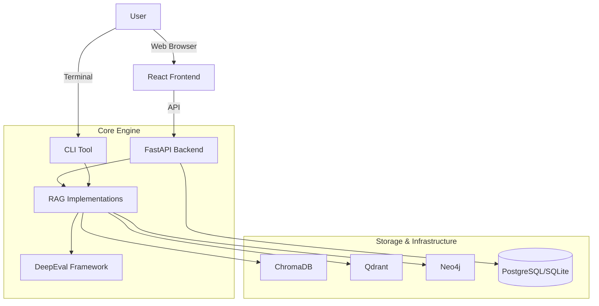

# RAG Evaluator Platform

[](https://github.com/fabrizioamort/RAG-evaluator/actions)
[](https://www.python.org/downloads/)
[](https://opensource.org/licenses/MIT)
[](https://github.com/astral-sh/ruff)
[](https://www.docker.com/)

**The comprehensive platform for designing, testing, and evaluating Retrieval Augmented Generation (RAG) systems.**

RAG Evaluator provides a unified environment to experiment with different retrieval strategies, manage knowledge bases, and rigorously benchmark performance using the [DeepEval](https://github.com/confident-ai/deepeval) framework.

---

## 🚀 Features

### 🏢 Enterprise-Grade Platform

- **Project Management:** Organize evaluations by project and use case.
- **Knowledge Base Management:** Upload and index documents (PDF, DOCX, TXT) with ease.
- **Visual Analytics:** Interactive dashboards to track performance trends over time.
- **Metric Explainability:** Understand *why* a score is low with detailed reasoning from the LLM judge.

### 🧠 Advanced RAG Architectures

Compare multiple implementation strategies out-of-the-box (see [RAG Strategies Guide](docs/rag_strategies.md) for details):

1. **Vector Semantic Search:** Baseline RAG using ChromaDB and OpenAI embeddings.
2. **Hybrid Search:** Combines dense (semantic) and sparse (keyword/SPLADE) vectors using Qdrant and RRF fusion.
3. **Graph RAG:** Leverages Neo4j knowledge graphs for structured, relationship-aware retrieval.
4. **Filesystem RAG:** An agentic approach that navigates file structures like a human developer.

### 📊 Rigorous Evaluation

Powered by [DeepEval](https://github.com/confident-ai/deepeval), evaluations are fully configurable. You can select any combination of the following metrics for each run:

- **Faithfulness:** Checks for "hallucinations" (information not present in your documents).
- **Answer Relevancy:** Assesses if the answer actually addresses the prompt.
- **Contextual Precision:** Measures the quality of the ranking in your retrieval.
- **Contextual Recall:** Checks if the retrieval system found all the necessary information.
- **Correctness (G-Eval):** Uses "LLM-as-a-judge" to verify semantic equivalence between the generated answer and the ground truth, ignoring minor phrasing differences.

👉 **[Read the Full Metrics Guide](docs/metrics.md)** for detailed definitions and usage strategies.

---

## 🏗️ Architecture

The project consists of two main components that share the same core RAG logic:

1. **The Platform (Web UI):** A modern Full-Stack application (FastAPI + React) for teams and production use cases.
2. **The CLI Tool:** A powerful command-line interface for local development, debugging, and CI/CD integration.



---

## ⚡ Quick Start

### Option A: The Platform (Recommended)

Run the full stack (Frontend, Backend, Databases) using Docker.

**Prerequisites:** Docker & Docker Compose.

1. **Clone the repository:**

    ```bash
    git clone https://github.com/fabrizioamort/RAG-evaluator.git
    cd RAG-evaluator
    ```

2. **Configure Environment:**

    ```bash
    cp .env.example .env
    # Edit .env and set your OPENAI_API_KEY
    ```

3. **Launch:**

    ```bash
    docker-compose up -d
    ```

4. **Access:**
    - **Dashboard:** [http://localhost:3000](http://localhost:3000)
    - **API Docs:** [http://localhost:8000/api/v1/docs](http://localhost:8000/api/v1/docs)

### Option B: The CLI (For Developers)

Run evaluations directly from your terminal.

**Prerequisites:** Python 3.11+ and [uv](https://github.com/astral-sh/uv).

1. **Install Dependencies:**

    ```bash
    uv sync
    ```

2. **Prepare Data:**

    ```bash
    # Index documents for semantic search
    uv run rag-eval prepare --rag-type vector_semantic --input-dir data/raw
    ```

3. **Run Evaluation:**

    ```bash
    uv run rag-eval evaluate --rag-type vector_semantic
    ```

See the [CLI Reference](docs/cli.md) for advanced usage.

---

## 📚 Documentation

- **[Deployment Guide](docs/deployment.md):** Detailed production setup instructions.
- **[RAG Strategies Guide](docs/rag_strategies.md):** Deep dive into Vector, Hybrid, Graph, and Filesystem RAG architectures.
- **[Custom RAG Integration](docs/custom_rag_integration.md):** How to develop and integrate your own RAG system for evaluation.
- **[API Reference](docs/api.md):** Comprehensive API documentation for the backend.
- **[CLI Reference](docs/cli.md):** Command-line usage, flags, and advanced RAG setup (Graph, Hybrid, etc.).
- **[Contributing](CONTRIBUTING.md):** Guide for developers wanting to add new features or RAG types.

---

## 🔧 Configuration

The system is configured via the `.env` file. Key settings include:

- **LLM:** `OPENAI_API_KEY`, `OPENAI_MODEL` (default: `gpt-4-turbo-preview`)
- **Databases:** `QDRANT_URL`, `NEO4J_URI`
- **Evaluation:** `EVAL_FAITHFULNESS_THRESHOLD`, `DEEPEVAL_ASYNC_MODE`

See `.env.example` for all available options.

---

## 🛠️ Development

### Prerequisites

- Python 3.11+
- [uv](https://github.com/astral-sh/uv) (Python package manager)
- Node.js 18+ and npm
- Make (optional, but recommended)
- Docker & Docker Compose (for infrastructure)

### Setup

```bash
# Install all dependencies (core + backend + frontend)
make install

# Or install individually:
uv sync --all-extras              # Core library
cd platform/backend && uv sync    # Backend
cd platform/frontend && npm install  # Frontend
```

### Running Tests

```bash
# Run all tests
make test

# Run specific test suites
make test-core      # Core library tests (pytest)
make test-backend   # Backend API tests (pytest)
make test-frontend  # Frontend tests (vitest)
```

### Linting & Formatting

```bash
# Run all linters
make lint

# Run specific linters
make lint-core      # ruff + mypy on src/rag_evaluator
make lint-backend   # ruff on platform/backend
make lint-frontend  # eslint on platform/frontend

# Format code
make format
```

### Pre-Push Check

Run all checks before pushing:

```bash
make check          # Sequential: format → lint → test

# Or run in parallel (faster):
make check-parallel -j3
```

### Development Servers

```bash
# Start infrastructure (databases)
make dev-infra

# Start backend (in separate terminal)
make dev-backend

# Start frontend (in separate terminal)
make dev-frontend
```

### Available Make Targets

Run `make help` to see all available commands:

```
make install          - Install all dependencies
make test             - Run all tests
make lint             - Run all linters
make format           - Format code with ruff
make check            - Run all checks (format + lint + test)
make check-parallel   - Run independent checks in parallel
make dev-backend      - Start backend server
make dev-frontend     - Start frontend dev server
make dev-infra        - Start infrastructure containers
make clean            - Clean generated files
```

---

## License

This project is licensed under the MIT License - see the [LICENSE](LICENSE) file for details.
