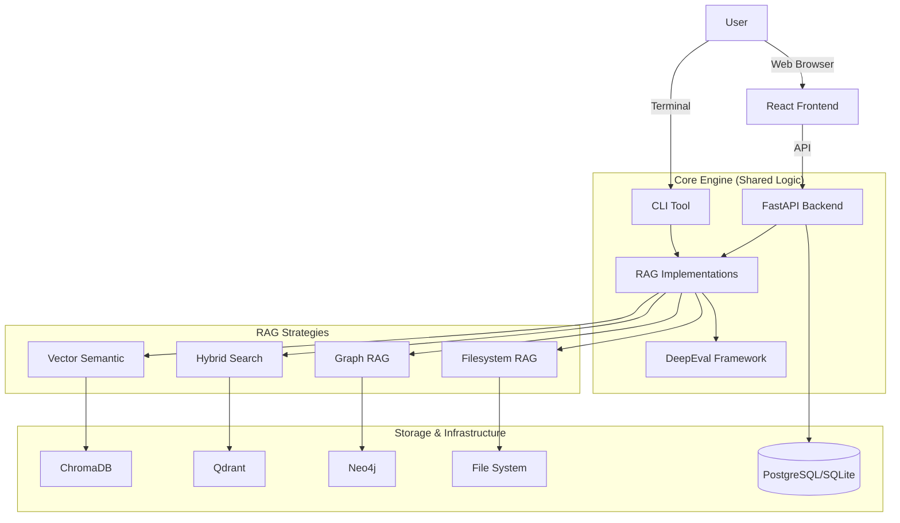

# RAG Evaluator Platform - Technical Specification

**Version:** 1.2
**Date:** 2026-01-16
**Status:** Live

## Executive Summary

RAG Evaluator is a production-ready Platform for comparing and evaluating four distinct RAG (Retrieval Augmented Generation) architectures. The project serves as both a technical portfolio piece and a community resource for understanding RAG performance tradeoffs across different approaches.

**Core Value Proposition:** Provide objective, reproducible comparisons of RAG architectures using standardized evaluation metrics, enabling informed decisions about RAG implementation strategies.

## Project Goals

### Primary Goals

1. **Working Implementations** - Deliver 4 fully functional RAG implementations with comprehensive tests
2. **Platform Experience** - Provide a modern, full-stack web application for managing evaluations.
3. **Portfolio Impact** - Demonstrate technical depth, production readiness, and full-stack capability
4. **Learning Outcomes** - Deep understanding of RAG architectures, tradeoffs, and evaluation methodologies
5. **Community Contribution** - Provide useful benchmarks and insights to the broader RAG development community

### Success Criteria

- ✅ All 4 RAG types implemented and functional
- ✅ Platform (Backend/Frontend) fully operational
- ✅ Each RAG meets minimum performance thresholds:
  - Accuracy: DeepEval scores >0.7 (faithfulness)
  - Latency: Query response time <10 seconds
  - Cost: Reasonable API costs relative to performance
- ✅ Comprehensive evaluation framework with statistical analysis
- ✅ Professional documentation and portfolio presentation
- ✅ GitHub repository generates community interest (stars, forks, discussions)

## Architecture Overview

### Design Principles

1. **Abstract Base Class Pattern** - All RAG implementations inherit from `BaseRAG` interface
2. **Fair Comparison** - Standardized evaluation methodology with equal treatment across implementations
3. **RAG-Optimized Configuration** - Each RAG type uses its optimal chunking and configuration strategy
4. **Production Quality** - CI/CD, type checking, comprehensive testing, proper error handling
5. **Cloud-Ready** - Designed for cloud deployment via Docker

### System Components

## RAG Implementation Specifications

### 1. Vector Semantic Search (ChromaDB) ✅ COMPLETE

**Status:** Production-ready
**Database:** ChromaDB (local)
**Embeddings:** OpenAI text-embedding-3-small

**Features:**
- Document loading from multiple formats (TXT, PDF, DOCX)
- RecursiveCharacterTextSplitter chunking
- Cosine similarity search
- LLM-based answer generation

### 2. Hybrid Search RAG ✅ COMPLETE

**Status:** Production-ready
**Database:** Qdrant (local via Docker)
**Vectors:** Dense (OpenAI) + Sparse (SPLADE)

**Technical Approach:**
- **Native Hybrid Search:** Qdrant stores both dense and sparse vectors.
- **RRF Fusion:** Combines results robustly.
- **Client-Side Encoding:** FastEmbed for SPLADE generation.

### 3. Graph RAG ✅ COMPLETE

**Status:** Production-ready
**Database:** Neo4j (local via Docker)
**Framework:** neo4j-graphrag

**Technical Approach:**
- **Dynamic Schema:** LLM infers node labels and relationships.
- **Hybrid Retrieval:** Vector search + Graph traversal.
- **Ingestion Pipeline:** Uses `neo4j-graphrag` for extraction.

### 4. Filesystem RAG (Agentic Explorer) ✅ COMPLETE

**Status:** Production-ready
**Concept:** LLM-guided file system navigation and retrieval.

**Technical Approach:**
- **Agent:** ReAct-based agent using LangGraph/AutoGen concepts.
- **Tools:** `list_directory`, `read_file`, `grep_search`, `find_files`.
- **Workflow:** Agent explores the directory structure (prepared index) to find answers, mimicking a developer.

**Unique Value:**
- No vector indexing required (uses file structure).
- Highly interpretable reasoning traces.

## Evaluation Framework

### Metrics (DeepEval)

1. **Faithfulness** (0-1): Answer derived only from retrieved context
2. **Answer Relevancy** (0-1): Answer addresses the question
3. **Contextual Precision** (0-1): Retrieved documents are relevant
4. **Contextual Recall** (0-1): All relevant information was retrieved

**Configuration (via .env):**
- Thresholds: 0.7 default
- Async mode: Configurable for rate limits

### Reporting

- **JSON/Markdown Reports:** Generated by CLI/Backend.
- **UI Visualization:** Platform Dashboard shows trends, traces, and comparisons.

## Platform Specification

### Backend (FastAPI)
- **REST API:** Endpoints for Projects, Knowledge Bases, Evaluations.
- **Database:** PostgreSQL (Production) / SQLite (Dev).
- **Async:** Fully async architecture for scalable evaluation handling.

### Frontend (React)
- **Modern UI:** Tailwind CSS + Shadcn UI components.
- **Features:**
  - Project Dashboard
  - Interactive Evaluation Results
  - Retrieval Traces visualization
  - Configuration Management

## Deployment

**Docker Compose:**
- Orchestrates Backend, Frontend, Qdrant, Neo4j, and PostgreSQL.
- Single command startup: `docker-compose up -d`.

---

**Document Status:** v1.2 (Platform Release)
**Last Updated:** 2026-01-16
**Status:** All 4 RAG implementations + Platform complete.