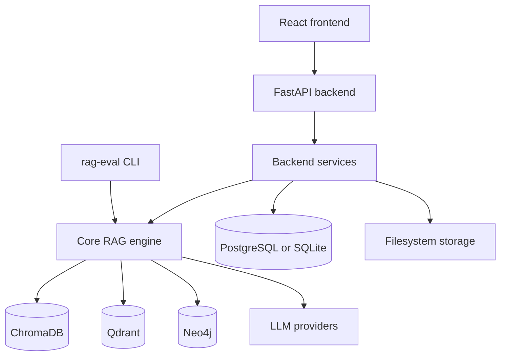
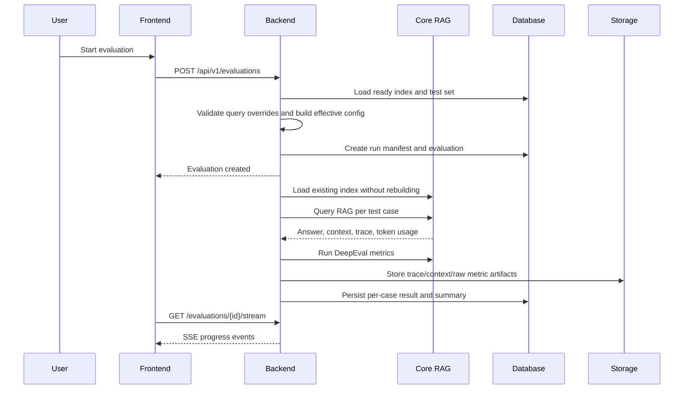
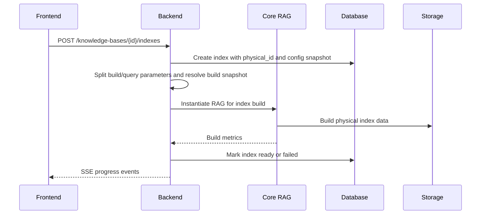

# Architecture

RAG Evaluator is split into a reusable Python core, a FastAPI backend, and a React
frontend. The CLI and platform share the same RAG implementations and evaluation logic.

## Repository Layout

```text
RAG-evaluator/
  src/rag_evaluator/          Core package and CLI
  platform/backend/           FastAPI backend, database models, services, tests
  platform/frontend/          React/Vite/Tailwind frontend
  docs/                       Public documentation
  data/                       Local CLI input data and generated datasets
  reports/                    CLI evaluation reports
  storage/                    Backend documents, indexes, artifacts, and logs
  docker/                     Full-stack Compose files
```

## High-Level Components



## Core Package

Location: `src/rag_evaluator/`

Responsibilities:

- Define the `BaseRAG` interface.
- Load documents from supported formats.
- Implement built-in RAG strategies.
- Run DeepEval metrics.
- Generate CLI reports.
- Provide the `rag-eval` console script.

Important modules:

| Module | Purpose |
| --- | --- |
| `common/base_rag.py` | Shared interface and `RAGConfig`. |
| `common/provider_interfaces.py` | Retrieval, generation, chunk, and trace DTOs. |
| `common/token_tracker.py` | Thread-safe token accounting. |
| `common/document_loaders.py` | PDF, DOCX, TXT, and related document loading. |
| `rag_implementations/registry.py` | Shared RAG type metadata and dynamic class lookup. |
| `evaluation/evaluator.py` | DeepEval integration and metric execution. |
| `evaluation/report_generator.py` | JSON and Markdown reports. |
| `cli.py` | CLI commands for prepare, evaluate, and Streamlit UI. |

## RAG Interface

Each implementation inherits from `BaseRAG`.

Required methods:

```python
def prepare_documents(self, documents_path: str) -> None:
    ...

def query(self, question: str, top_k: int = 5) -> dict[str, Any]:
    ...

def get_metrics(self) -> dict[str, Any]:
    ...
```

Recommended optional methods:

- `load_index()` attaches to an existing prepared index without mutating build
  artifacts. The default implementation is a no-op for implementations that already
  load lazily.
- `retrieve()` returns `RetrievedContext` for retrieval-only operation.
- `generate()` creates an answer from retrieved context.
- `query_with_trace()` uses retrieval and generation to expose a full trace.
- `close()` releases external resources.

The backend uses these methods through `RAGAdapterService`; the CLI uses them directly.

## Built-In RAG Implementations

| Type | Package | Storage |
| --- | --- | --- |
| `vector_semantic` | `rag_implementations/vector_semantic` | ChromaDB |
| `vector_hybrid` | `rag_implementations/vector_hybrid` | Qdrant |
| `graph_rag` | `rag_implementations/graph_rag` | Neo4j |
| `filesystem_rag` | `rag_implementations/filesystem_rag` | Local prepared filesystem |
| `rlm_rag` | `rag_implementations/rlm_rag` | Local prepared filesystem plus Python exploration tools |

See [RAG Strategies](rag_strategies.md) for behavior and trade-offs.

## Backend

Location: `platform/backend/`

Responsibilities:

- Serve REST APIs under `/api/v1`.
- Manage projects, knowledge bases, indexes, test sets, RAG configs, evaluations,
  comparisons, trends, playground queries, templates, and webhooks.
- Store metadata in PostgreSQL or SQLite.
- Store uploaded documents and generated artifacts under `STORAGE_PATH`.
- Run index builds and evaluations in background tasks.
- Stream progress with Server-Sent Events.

Key directories:

```text
platform/backend/app/
  api/          Route handlers
  models/       SQLAlchemy ORM models
  schemas/      Pydantic request/response schemas
  services/     Business logic
  utils/        Logging, templates, exceptions
  config.py     Environment-backed settings
  database.py   Async SQLAlchemy engine/session setup
  main.py       FastAPI application entry point
```

Important services:

| Service | Purpose |
| --- | --- |
| `rag_adapter.py` | Converts platform RAG configs into core RAG instances. |
| `index_build_service.py` | Creates, builds, retries, archives, and deletes indexes. |
| `evaluation_runner.py` | Executes evaluations and persists results. |
| `artifact_store.py` | Content-addressed storage for traces, contexts, and raw metrics. |
| `test_generator_service.py` | Generates and quality-checks candidate test cases. |
| `comparison_service.py` | Computes aggregate and per-question evaluation comparisons. |
| `playground_service.py` | Runs ad hoc multi-index queries and stores query history. |
| `job_checkpoint_service.py` | Supports pause/resume behavior. |
| `job_event_log.py` | Persists and streams progress events. |

## Frontend

Location: `platform/frontend/`

Responsibilities:

- Provide the web workflow for projects, knowledge bases, indexes, test sets,
  RAG configs, evaluations, comparisons, trends, and playground queries.
- Use TanStack Query for API data fetching and cache invalidation.
- Use Vite proxying in development so `/api` reaches the backend.

Routes:

| Route | Component |
| --- | --- |
| `/` | Dashboard |
| `/projects` | Project list |
| `/projects/:id` | Project workspace tabs |
| `/knowledge-bases/:id` | Knowledge base details |
| `/indexes` | Index list |
| `/indexes/:id` | Index details |
| `/playground` | Playground |

## Data Flow: Web Evaluation



## Data Flow: Index Build



## Persistence Model

Metadata is stored in SQL tables for:

- Projects.
- Knowledge bases, documents, versions, and indexes.
- Test sets, test cases, test templates, and generation jobs.
- RAG configurations.
- Evaluations, evaluation results, run manifests, artifacts, and comparisons.
- Playground query history.
- Webhooks.

Large generated JSON payloads such as retrieval traces and raw metric outputs are stored
as content-addressed files through `ArtifactStore`, with database rows pointing to the
artifact IDs.

## Reproducibility

Evaluations record a run manifest containing:

- Legacy RAG config snapshot.
- Immutable build config snapshot from the selected ready index.
- Query overrides requested for the run.
- Effective config snapshot used to instantiate the query RAG.
- Knowledge base/index snapshot.
- Generation model.
- Judge model.
- Prompt template metadata.
- Platform and core versions.

This lets users understand what was evaluated even after live project settings change.

## Configuration Boundaries

- Root `.env` configures the CLI and shared core defaults.
- `platform/backend/.env` can override backend runtime settings.
- RAG configs in the database capture provider, default generation model, embedding
  model, base URL, and RAG parameters for platform-managed runs.
- Index build snapshots freeze build-time choices such as embedding model, chunking,
  sparse model, graph extraction model, and managed storage.
- Evaluation and playground requests can provide query overrides for query-time
  controls such as generation model, top-k, and agent limits.

## Development Notes

- Run backend tests from `platform/backend`.
- Add an Alembic migration when changing backend models.
- Keep `src/rag_evaluator/rag_implementations/registry.py` as the source of truth for
  RAG type metadata, including parameter phase and platform-managed flags.
- Use index-specific storage paths to avoid collisions between experiments.
