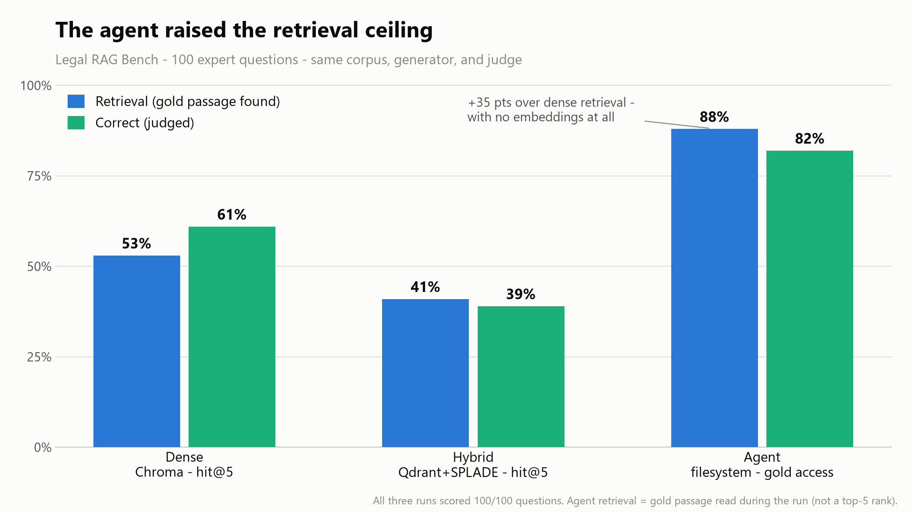
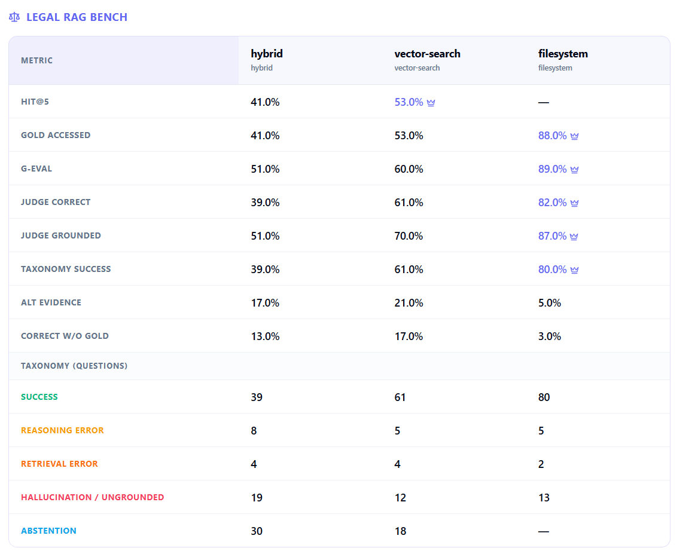

# Don't pick a RAG architecture. Measure it

*A reproducible RAG architecture case study on Isaacus' Legal RAG Bench: 4,876 passages from the Victorian Criminal Charge Book, 100 expert questions, gold passage labels, and a published paper arguing that retrieval sets the ceiling for legal QA.*

*Disclosure: This article was drafted with AI assistance and fully reviewed, fact-checked, and edited by the author. The technical decisions, analysis, and conclusions are mine.*

Every team building retrieval-augmented generation hits the same fork. What RAG architecture is best for your use case? Do you need plain dense vector search? Add a sparse retriever and fuse? Or skip the index and let an agent read files the way a junior associate reads a binder? The internet's answer is vibes and blog posts benchmarked on someone else's corpus. The honest answer is "it depends on your corpus and your use case" — which is useless advice unless you can *measure* it, on your data, under controlled conditions, in a way you still trust three weeks later.

That measurement problem is what [RAG Evaluator](https://github.com/fabrizioamort/RAG-evaluator) is for. I used Legal RAG Bench not as a leaderboard, but as a calibration harness: external gold labels, a published retrieval baseline, and rule-application questions hard enough to separate architectures. This article is the platform's first full case study: three retrieval architectures, one legal benchmark, everything held fixed except the architecture. The case study produced three findings I did not fully expect — hybrid search *losing* to plain dense, a measurement bug that would have shipped a wrong conclusion, and an agentic retriever moving into the same retrieval-access range as the paper's domain-tuned embedder through trace-driven engineering rather than model changes. Each finding exists because of a specific platform capability, and that is the real point of this piece: the findings are the demo.

Here is the headline result, and then I'll show the machinery that produced it:

| System | Retrieval mode | Retrieval | Correct | Grounded | Abstained | Avg latency | Cost/question |
|---|---|---|---|---|---|---|---|
| vector-search (Chroma) | dense | 53.0% hit@5 | 61.0% | 70.0% | 18.0% | 6.2s | $0.0002 |
| hybrid (Qdrant + SPLADE) | dense + sparse | 41.0% hit@5 | 39.0% | 51.0% | 30.0% | 7.1s | $0.0002 |
| filesystem (agent) | agentic file reads | **88.0%** gold | **82.0%** | 87.0% | 0.0% | 192.0s | $0.0150 |

*All three runs completed generation and judging on all 100 questions. Retrieval is hit@5 on the gold passage id for the vector systems, and gold access — did the agent actually read the gold passage during its run — for the agent. Phase 1 numbers; the honest-limits section at the bottom matters.*

<picture>
  <source media="(prefers-color-scheme: dark)" srcset="../images/legal-rag-retrieval-vs-correctness-v1-dark.png">
  
</picture>

## The platform workflow

I could have run this comparison as a benchmark script — a `for` loop over 100 questions, a FAISS index, a CSV at the end. That is how many comparisons get done, and it is exactly why many of them are not reproducible a week later: the embedding model lives in one variable, the chunk size in another, the judge prompt in a third, and when someone challenges your table you cannot say with confidence which knobs were set to what.

RAG Evaluator is a web platform (FastAPI + React, with a CLI sharing the same core) that turns a RAG experiment into a managed workflow. From a user's point of view, you start with a Knowledge Base: the corpus, imported once and versioned. Then you create RAG Configs for the architectures you want to test — dense vector search, hybrid dense+sparse retrieval, or filesystem/agentic retrieval — and build an isolated Index from each config. You attach a Test Set, run Evaluations, inspect the per-question traces, compare completed runs side by side, and use trend views to see whether an iteration improved the system or just moved the error somewhere else.

The user story is simple; the architecture is built around two constraints.

**First: every run is made of persistent, inspectable entities, and the configuration is frozen with the result.** A versioned Knowledge Base holds the corpus; a RAG Config per architecture (`vector_semantic`, `vector_hybrid`, `filesystem_rag`) builds an isolated Index, frozen with a full `config_snapshot`; an Evaluation runs a Test Set against a ready index and stores every retrieval trace; a Comparison lines finished evaluations up side by side and exports the tables in this article. When I export a comparison, the manifest travels with it. I do not have to remember that the hybrid index used `text-embedding-3-large` at 3,072 dimensions with `chunk_size=8000` and `prithivida/Splade_PP_en_v1` on the sparse side. It is in the file:

```json
{
  "embedding_model": "text-embedding-3-large",
  "build_parameters": {
    "chunk_size": 8000, "chunk_overlap": 0,
    "embedding_dimension": 3072,
    "sparse_model_name": "prithivida/Splade_PP_en_v1"
  },
  "llm_model": "deepseek/deepseek-v4-flash",
  "query_execution": { "top_k": 5 },
  "rag_type": "vector_hybrid"
}
```

**Second: the same RAG classes run everywhere.** The UI does not shell out to a CLI. React talks to FastAPI, FastAPI calls the same `BaseRAG` implementations the command line would. When I compare "Chroma dense" to "the agent," I am comparing the actual retrieval code, not two re-implementations that happen to share a name.

<picture>
  
</picture>

The export makes the result reproducible enough to argue with: corpus version, index snapshot, RAG config, test set, generation policy, judge, retrieval traces, per-question latency, per-question cost, and the aggregate comparison table all travel together.

Everything else in this article — the calibration that caught a bug, the traces that rebuilt the agent, the cost accounting — is these two ideas earning their keep.

## The case study: a benchmark that bites back

To test the platform I wanted a benchmark with external ground truth, a published baseline to calibrate against, and a domain hard enough to separate the architectures. Isaacus introduced [Legal RAG Bench](https://isaacus.com/blog/legal-rag-bench) on February 20, 2026, and the accompanying arXiv paper by Abdur-Rahman Butler and Umar Butler followed on March 2, 2026. The benchmark contains 4,876 passages from the Victorian Criminal Charge Book, 100 expert-written questions, one gold supporting passage per question, and a long-form reference answer. The official harness indexes one passage as one document — no chunking games — and measures whether the gold passage id shows up in the top 5 retrieved. That is `hit@5`, the cleanest number in the whole exercise because no LLM judge touches it.

The paper's claim is that for legal QA, retrieval quality is the ceiling: their best general-purpose embedder, OpenAI's `text-embedding-3-large`, tops out at 52% retrieval at k=5, and correctness rises and falls with it. (Their domain-tuned Kanon 2 embedder reaches roughly 86% — a +34-point jump, the biggest lever in their study. Hold that number; it comes back.) The paper varies the embedding model and holds the retrieval *architecture* fixed. This case study does the opposite — and that is precisely the kind of question a platform is for, because "same everything except the architecture" is a controlled experiment, and controlled experiments die of configuration drift when run by hand.

What makes legal QA specifically nasty: the questions are rule-application, not keyword lookup. The corpus states a general rule; the question is a named hypothetical ("Emma is charged with..."). The right passage rarely shares vocabulary with the question. This detail will come back and explain almost everything below.

**The setup, stated plainly.** One Knowledge Base version, three isolated indexes. To stay honest against the paper: `chunk_size=8000`, `chunk_overlap=0`, and a post-build assertion that the index holds exactly 4,876 chunks — one passage, one chunk, or you are measuring a different experiment. `text-embedding-3-large` at 3,072 dimensions for both vector systems (the agent uses no embeddings); `deepseek/deepseek-v4-flash` via OpenRouter at temperature 0 as both generator and judge; `top_k=5` for the vector systems; the agent gets a budget instead — 40 reasoning iterations, 80 tool calls, 40 file reads per question. Generation is closed-book: the prompt licenses the model to *apply* rules from the retrieved context, but if the context holds no relevant rule it must abstain with a fixed sentence.

Two disclosures before any results. The same model generated *and* judged — consistent across all three architectures, but a model grading its own homework is a known bias, so read correctness as directional, not as the paper's fixed GPT-5.2 verdict. And closed-book tethers correctness to what the retriever surfaced, which is a feature for comparing retrievers fairly and a difference from the paper, which is effectively open-book.

## The platform caught a measurement bug

My first calibration run reported `hit@5` of 38%. The paper says 52% for the same embedding model. A 14-point gap is not a rounding error, and it is exactly the kind of result that, published unexamined, makes you look either lucky or wrong.

The platform let me prove which. Because the vectors, the traces, and the per-question retrievals were all stored, I could replay the paper's pipeline offline against the index as-built: re-embed a stored passage (cosine 1.0000 against its own stored vector — same embedding space), then run both a brute-force cosine top-5 and Chroma's native HNSW query. Both returned 52%. Dead on the paper. So retrieval was never the problem — my *measurement* was. The id-extraction step was emitting more than one id per retrieved chunk, so the five real passages landed at list positions 1, 3, 5, 7, 9, and a rank-≤5 check could not see the last two. One fix later, `hit@5` read 52% — and `gold_accessed`, a membership check immune to the interleaving, had been quietly right the whole time, telling me the two numbers should have agreed.

A script would have printed 38% and I would have written a confident, wrong article about this stack underperforming the paper. An evaluation you cannot audit is an opinion with decimals. (Footnote for the careful reader: on the final rebuilt index used for the runs here, the same measurement reads 53% — a one-question wobble around the paper's 52%, the noise floor of a 100-question set.)

## Finding 1: hybrid lost to plain dense

Conventional wisdom says dense-plus-sparse with reciprocal rank fusion is a strict upgrade — semantic matching *and* exact-term matching, fused. On this corpus it went the other way: 41% hit@5 against dense's 53%. Adding SPLADE made retrieval worse.

My theory — labelled a theory because I did not chase it all the way down: legal questions are vocabulary-poor relative to their answers. The named hypothetical does not lexically resemble the doctrinal passage that resolves it, so a sparse retriever happily surfaces passages sharing legal boilerplate ("evidence," "jury," "charge") without sharing the specific rule, and RRF dilutes a strong dense signal with that noise. The per-case signals add a second insult: hybrid also did less with the gold passages it *did* find — 26 of its 41 gold hits became correct answers (63% conversion) against dense's 44 of 53 (83%), because the sparse side wraps even a successful retrieval in lexically-similar-but-wrong distractors.

The transferable lesson is narrower than "hybrid is bad": hybrid is a bet that lexical overlap signals relevance, and legal QA is close to the worst place to make that bet. Which is exactly why this decision should be measured per-corpus instead of inherited from a blog post — on a corpus where the bet pays, the same experiment would show it.

## Finding 2: passive retrievers are governed by retrieval — and the gold id undercounts the evidence

The paper's thesis reproduces cleanly on the hybrid row: 41% retrieval, 39% correct, pinned. The chain is mechanical and the abstention column shows it: when the top 5 holds no usable rule and the prompt is closed-book, an honest model abstains — hybrid abstained 30 times to dense's 18. A 12-point retrieval gap between dense and hybrid became a 22-point correctness gap. Swapping the retriever never changed the model; it changed how often the model was handed the answer.

One wrinkle matters before reading the dense row: the benchmark has one official gold passage, but the corpus sometimes states the same legal rule in more than one place.

The dense row carries a result a strict ceiling reading says should not happen: 53% retrieval, 61% correct — eight points above its own hit rate under a closed-book prompt. The platform's per-case signals explain it without magic. Seventeen of dense's correct answers came on questions where the gold passage was never retrieved, and in 21 cases the judge found the answer supported by a *different* retrieved passage than the official gold one. The Charge Book restates the same rule in more than one place — a charge document here, a commentary section there — so a single blessed gold id undercounts the evidence actually available in a top-5. The ceiling is real, but it is an *evidence* ceiling, not a gold-id ceiling, and `hit@5` against one gold passage is a lower bound on it. That distinction is invisible in a CSV with one accuracy column; it took per-question retrieval traces and an alternate-evidence signal to see.

## Finding 3: the agent moved the ceiling

The filesystem RAG treats the corpus as a filesystem — passages regrouped into documents, each with a generated summary and a BM25 index built at prep time — and it reads: prefetch, grep, pull the promising documents, read full text, decide whether it has enough. No top-5. Its retrieval metric is `gold_accessed`: did it actually read the gold passage. **88%.**

Against dense's 53% that is +35 points. The more interesting reference is the paper's own table: Isaacus needed Kanon 2, their domain-tuned legal embedder, to reach roughly 86% retrieval — the biggest lever in their study. This is not an apples-to-apples metric match, because the agent's `gold_accessed` is not rank-limited `hit@5`; I treat the comparison as directional. Still, the agent moved into the same retrieval-access range with no embeddings at all: BM25, file listings, summaries, and the ability to keep reading.

Here is the part that matters for the platform story: **that number did not come from the model, and it was not the first number.** The first full agent run scored 59% gold access. What took it to 88% was reading traces and fixing what they showed, over two rounds:

- BM25 returning five overlapping windows of the *same* passage, crowding the gold one out at rank 7 → dedupe by passage.
- The agent landing in the right section and satisficing on a sibling passage while the gold one sat unread in its own search results → a mandated sibling sweep before finalizing.
- Questions asking about "double jeopardy" when the corpus only ever says "punished more than once for the same act" → a statutory-vocabulary reformulation rule.
- An answer emitted after a single file read → a minimum-evidence guard.

Same model, same corpus, same budget — 29 points of retrieval, all of it engineering. That is the precise sense in which the ceiling moved. For a passive index, retrieval quality is a property you *buy* when you pick an embedder. For an agent, it is a surface you can *work* — provided your evaluation stack shows you where it fails. An earlier trace in the same vein: a question whose answer is "view" (the statute's collective term for a "demonstration, experiment or inspection") got answered "Inspection" because the agent had only been shown a lossy document *summary*; the trace showed right document, wrong granularity, and the fix was injecting focused full-text excerpts for top candidates. You do not debug that from an accuracy column.

Correctness followed retrieval, as the paper says it should: 82%, twenty-one points above dense, with the tightest gold-to-correct conversion of the three (79 of 88, 90%). And the abstention column reads zero — not rare, zero in 100, because an agent that can keep digging almost always finds something to stand on. It mostly converted that stubbornness into successes — 80 answers both correct *and* grounded, versus dense's 61 — but an agent that never says "I don't know" is one confident-wrong answer away from a production incident. Its 13 ungrounded answers are the number I would watch, not its accuracy.

## The bill, itemized

The platform tracks latency and provider-reported token costs per question, which turns "the agent is expensive" from a feeling into a line item. The agent averaged 192 seconds per question against 6–7 for the vector systems — thirty times slower, worst single question almost 35 minutes. It consumed 15.9 million prompt tokens across the run against roughly 180 thousand for each vector system: about 70× the cost per question, $0.015 against $0.0002.

And yet: $0.015 is a cent and a half. The entire 100-question agent run cost $1.50 on a cheap model. The premium is enormous in relative terms and almost nothing in absolute ones — which is exactly what makes this an operational decision rather than a leaderboard:

- **High-volume, latency-sensitive, synchronous** (a search box, anything user-facing): dense vector search. Fast, cheap, and on this benchmark it tracked the paper.
- **High-value, low-volume, accuracy-critical** (a memo a lawyer will rely on, where three minutes and a cent and a half are nothing against being wrong): the agent earns its latency.
- **Hybrid on this kind of legal rule-application QA:** I would not default to it without measuring first. Sparse retrieval is a bet on lexical overlap, and this domain did not pay it out.

<!-- screenshot: per-question retrieval trace from the legal-bench agent run goes here -->

## Honest limits

- **Self-judge.** One model generated and judged. Consistent across architectures, biased in absolute terms. A fixed-judge rerun is the Phase 2 I would do before quoting these as final.
- **Closed-book policy.** It tethers correctness to retrieved evidence and makes the vector numbers strict. The paper is effectively open-book, recovering retrieval misses from parametric legal knowledge. That gap is policy, not pipeline.
- **Phase 1 model.** `deepseek-v4-flash`, chosen for cost, is not the paper's GPT-5.2. Retrieval numbers are model-independent and calibrate cleanly; generation numbers are directional.
- **Gold access is not hit@5.** The agent's 88% counts a read of the gold passage at any point in its run; the vector systems face a rank-≤5 test. The comparison to Kanon 2's ~86% is directional, not a strict win claim — though the correctness column, which is metric-neutral, points the same way.
- **Not a replication.** This is Legal RAG Bench used as a controlled harness on one stack, with the paper as a calibration reference. The one number I put up against the paper directly is dense `hit@5` — 53.0% on the final index, 52.0% on the calibration run, against their 52%.
- **Phase 2 work.** The next validation pass is a fixed independent judge and a cost-focused agent rerun, so the directional result becomes a stronger benchmark claim.

## The real takeaway

The finding I lead with, though, is the method. The paper is right that retrieval is the ceiling — for retrievers that take what they're given. Hand the corpus to a retriever that can read, reason, and read again, and the ceiling stops being a property of your embedding model and becomes a surface you can work: 59% to 88% gold access without touching the model. But you only get to work that surface if you can see it, and you only trust the result if the whole experiment — corpus version, index config, prompts, judge, traces, costs — is pinned down well enough to survive an argument. That is what the platform is for. If you are standing at the dense-vs-hybrid-vs-agent fork, don't take my numbers. Clone the harness and run yours.

## References

- [Isaacus, "Introducing Legal RAG Bench", February 20, 2026](https://isaacus.com/blog/legal-rag-bench)
- [Abdur-Rahman Butler and Umar Butler, "Legal RAG Bench: an end-to-end benchmark for legal RAG", arXiv, March 2, 2026](https://arxiv.org/abs/2603.01710)

---

*Fabrizio Amort is a GenAI Architect specializing in RAG evaluation systems and agentic AI. [RAG Evaluator](https://github.com/fabrizioamort/RAG-evaluator) is an open-source platform for designing, testing, and comparing RAG architectures on real corpora. The numbers, config snapshots, and per-question traces in this piece were generated and exported by the platform; every table is a direct export, manifest included. Code, docs, and the full comparison export live in the repo.*
