# Getting Started

> **Your first RAG evaluation in under 10 minutes.**

Welcome to the RAG Evaluator Platform! This guide will walk you through setting up the platform and running your first evaluation. By the end, you'll have a working setup and understand the core workflow.

---

## Table of Contents

- [Prerequisites](#prerequisites)
- [Quick Start Options](#quick-start-options)
- [Option A: Web Platform](#option-a-web-platform-recommended)
- [Option B: CLI Tool](#option-b-cli-tool)
- [Your First Evaluation](#your-first-evaluation)
- [Understanding Results](#understanding-results)
- [Next Steps](#next-steps)

---

## Prerequisites

Before you begin, ensure you have:

| Requirement | Version | Check Command |
|-------------|---------|---------------|
| **Python** | 3.11+ | `python --version` |
| **Node.js** | 18+ | `node --version` |
| **Docker** | 24+ | `docker --version` |
| **Docker Compose** | v2+ | `docker compose version` |
| **OpenAI API Key** | - | [Get one here](https://platform.openai.com/api-keys) |

### Optional (for specific RAG types)

| RAG Type | Additional Requirement |
|----------|----------------------|
| Hybrid Search | Qdrant (included in Docker Compose) |
| Graph RAG | Neo4j (included in Docker Compose) |

---

## Quick Start Options

Choose the approach that best fits your needs:

| Option | Best For | Setup Time |
|--------|----------|------------|
| **[Web Platform](#option-a-web-platform-recommended)** | Teams, visual workflows, production use | ~5 minutes |
| **[CLI Tool](#option-b-cli-tool)** | Developers, scripting, CI/CD integration | ~3 minutes |

---

## Option A: Web Platform (Recommended)

The web platform provides a complete visual interface for managing projects, knowledge bases, and evaluations.

### Step 1: Clone and Configure

```bash
# Clone the repository
git clone https://github.com/fabrizioamort/RAG-evaluator.git
cd RAG-evaluator

# Create your environment file
cp .env.example .env
```

### Step 2: Add Your API Key

Edit the `.env` file and set your OpenAI API key:

```env
OPENAI_API_KEY=sk-your-api-key-here
```

### Step 3: Launch the Platform

```bash
# Start all services
docker-compose up -d
```

This will start:
- **Frontend** at [http://localhost:3000](http://localhost:3000)
- **Backend API** at [http://localhost:8000](http://localhost:8000)
- **PostgreSQL** database
- **Qdrant** vector store
- **Neo4j** graph database

### Step 4: Verify the Installation

Open [http://localhost:3000](http://localhost:3000) in your browser. You should see the dashboard:

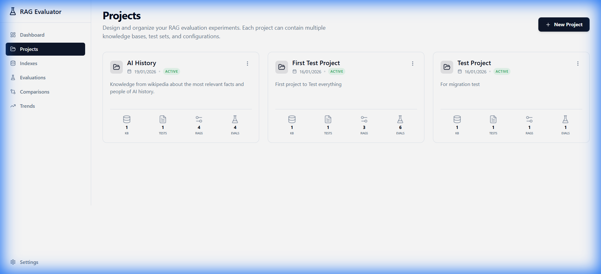
<!-- PLACEHOLDER: getting-started-dashboard.png - Screenshot of the empty dashboard with "Create your first project" prompt -->

### Step 5: Create Your First Project

1. Click **"+ New Project"**
2. Enter a project name (e.g., "My First RAG Evaluation")
3. Add an optional description
4. Click **"Create"**

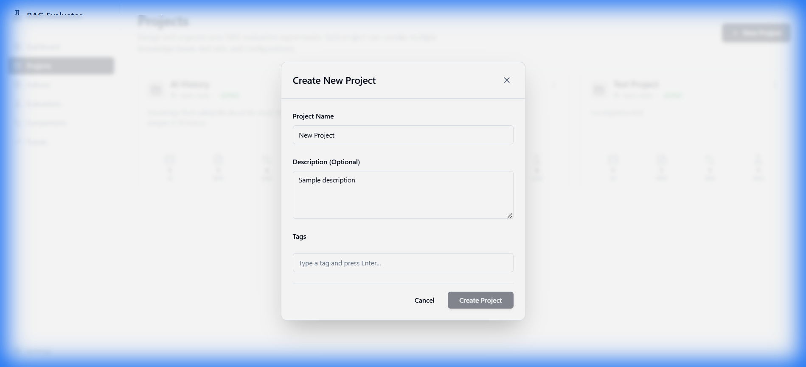
<!-- PLACEHOLDER: getting-started-create-project.png - Screenshot of the create project dialog -->

---

## Option B: CLI Tool

The CLI tool is perfect for developers who prefer terminal workflows or need to integrate with CI/CD pipelines.

### Step 1: Install Dependencies

```bash
# Clone the repository
git clone https://github.com/fabrizioamort/RAG-evaluator.git
cd RAG-evaluator

# Install Python dependencies
uv sync

# Create your environment file
cp .env.example .env
```

### Step 2: Configure API Key

Edit `.env` and add your OpenAI API key:

```env
OPENAI_API_KEY=sk-your-api-key-here
```

### Step 3: Prepare Sample Documents

Create a directory with some test documents:

```bash
# Create sample data directory
mkdir -p data/raw

# Add a sample document (or copy your own PDFs/DOCXs)
echo "RAG (Retrieval-Augmented Generation) is an AI framework that enhances \
large language model outputs by incorporating external knowledge retrieval. \
It combines the generative capabilities of LLMs with the precision of \
information retrieval systems." > data/raw/sample.txt
```

### Step 4: Index Your Documents

```bash
# Index documents using semantic search (ChromaDB)
uv run rag-eval prepare --rag-type vector_semantic --input-dir data/raw
```

You should see output like:
```
Loading documents from data/raw...
Found 1 documents
Splitting documents into chunks...
Created 3 chunks
Indexing chunks in ChromaDB...
Indexing complete! 3 chunks indexed.
```

### Step 5: Create a Test Set

Create a test set file at `data/test_set.json`:

```json
[
  {
    "question": "What is RAG?",
    "expected_answer": "RAG (Retrieval-Augmented Generation) is an AI framework that enhances large language model outputs by incorporating external knowledge retrieval."
  },
  {
    "question": "What does RAG combine?",
    "expected_answer": "RAG combines the generative capabilities of LLMs with the precision of information retrieval systems."
  }
]
```

### Step 6: Run Your First Evaluation

```bash
uv run rag-eval evaluate --rag-type vector_semantic --verbose
```

---

## Your First Evaluation

Whether you're using the web platform or CLI, here's what happens during an evaluation:

### Evaluation Workflow

```
┌─────────────────────────────────────────────────────────────────────┐
│                        EVALUATION WORKFLOW                           │
├─────────────────────────────────────────────────────────────────────┤
│                                                                     │
│  1. LOAD TEST SET                                                   │
│     ┌─────────────────────────────────────────────────────────┐    │
│     │  Test Case 1: "What is RAG?"                             │    │
│     │  Expected: "RAG is an AI framework..."                   │    │
│     └─────────────────────────────────────────────────────────┘    │
│                              │                                      │
│                              ▼                                      │
│  2. QUERY RAG SYSTEM                                                │
│     ┌─────────────────────────────────────────────────────────┐    │
│     │  Question ──▶ Retrieval ──▶ Context ──▶ Generation      │    │
│     │                                            │             │    │
│     │                                            ▼             │    │
│     │                                      Generated Answer    │    │
│     └─────────────────────────────────────────────────────────┘    │
│                              │                                      │
│                              ▼                                      │
│  3. EVALUATE WITH DEEPEVAL                                          │
│     ┌─────────────────────────────────────────────────────────┐    │
│     │  ┌────────────┐  ┌────────────┐  ┌────────────┐        │    │
│     │  │Faithfulness│  │  Answer    │  │Correctness │        │    │
│     │  │   0.95     │  │ Relevancy  │  │   0.88     │        │    │
│     │  │            │  │   0.92     │  │            │        │    │
│     │  └────────────┘  └────────────┘  └────────────┘        │    │
│     └─────────────────────────────────────────────────────────┘    │
│                              │                                      │
│                              ▼                                      │
│  4. GENERATE REPORT                                                 │
│     ┌─────────────────────────────────────────────────────────┐    │
│     │  Summary metrics, per-case results, recommendations     │    │
│     └─────────────────────────────────────────────────────────┘    │
│                                                                     │
└─────────────────────────────────────────────────────────────────────┘
```

### Web Platform Workflow

1. **Navigate to your project**
2. **Create a Knowledge Base**
   - Click "Add Knowledge Base"
   - Upload your documents (PDF, DOCX, TXT)

   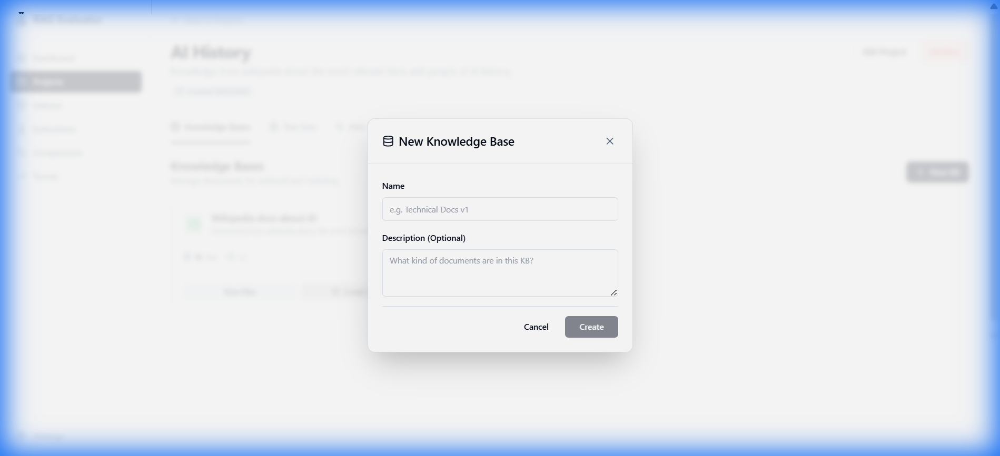
   <!-- PLACEHOLDER: getting-started-upload-docs.png - Screenshot of document upload interface -->

3. **Build an Index**
   - Select a RAG type (start with "Vector Semantic")
   - Click "Build Index"
   - Wait for indexing to complete

   
   <!-- PLACEHOLDER: getting-started-build-index.png - Screenshot of index building progress -->

4. **Create a Test Set**
   - Click "Add Test Set"
   - Add questions and expected answers manually, OR
   - Use "Generate from KB" to auto-generate test cases

   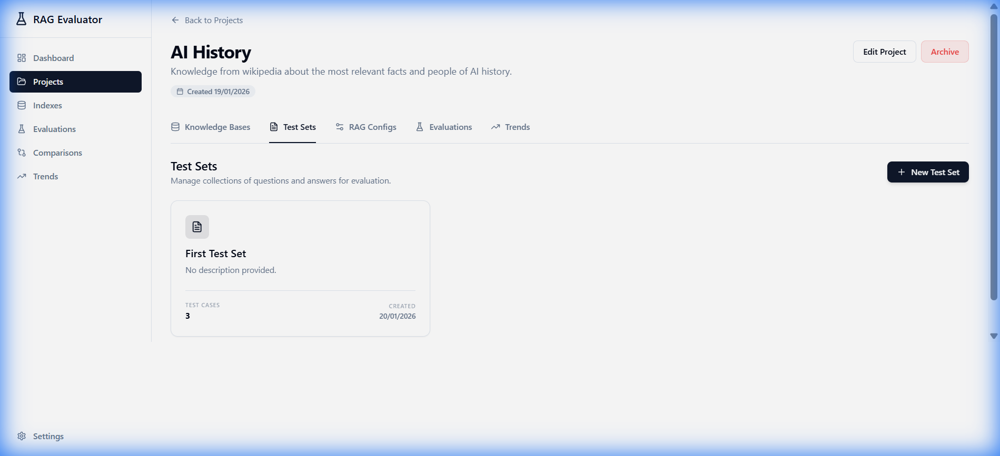
   <!-- PLACEHOLDER: getting-started-test-set.png - Screenshot of test set creation -->

5. **Start Evaluation**
   - Click "Start Evaluation"
   - Select your knowledge base, test set, and RAG config
   - Choose which metrics to evaluate
   - Click "Run"

   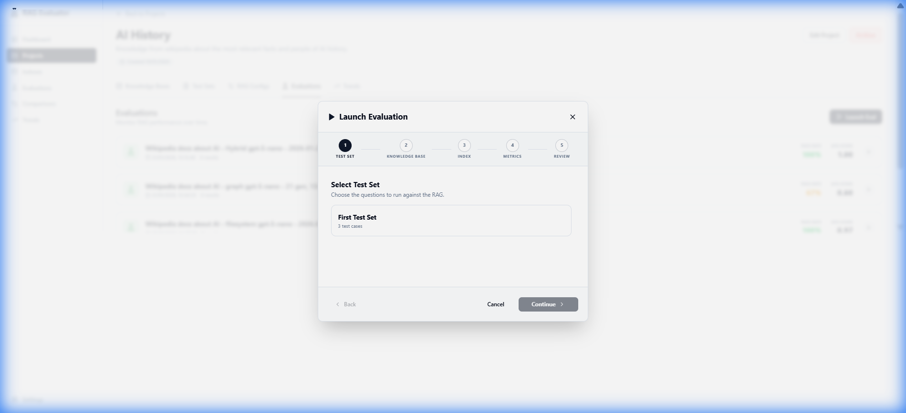
   <!-- PLACEHOLDER: getting-started-start-eval.png - Screenshot of evaluation wizard -->

6. **Monitor Progress**
   - Watch real-time progress via SSE streaming
   - See individual test cases complete

   
   <!-- PLACEHOLDER: getting-started-eval-progress.png - Screenshot of evaluation in progress -->

---

## Understanding Results

After an evaluation completes, you'll see detailed results:

### Summary View

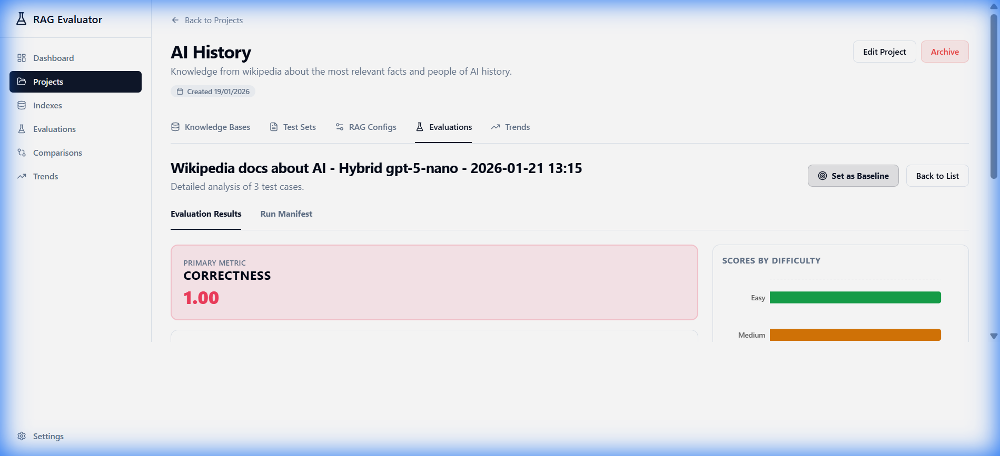
<!-- PLACEHOLDER: getting-started-results-summary.png - Screenshot of results summary with metric cards -->

The summary shows aggregate metrics:

| Metric | What It Tells You | Good Score |
|--------|-------------------|------------|
| **Faithfulness** | Is the answer grounded in retrieved context? | > 0.85 |
| **Answer Relevancy** | Does the answer address the question? | > 0.80 |
| **Contextual Precision** | Are relevant chunks ranked first? | > 0.75 |
| **Contextual Recall** | Did we find all needed information? | > 0.80 |
| **Correctness** | Is the answer semantically correct? | > 0.75 |

### Per-Case Results

Click on any test case to see detailed results:

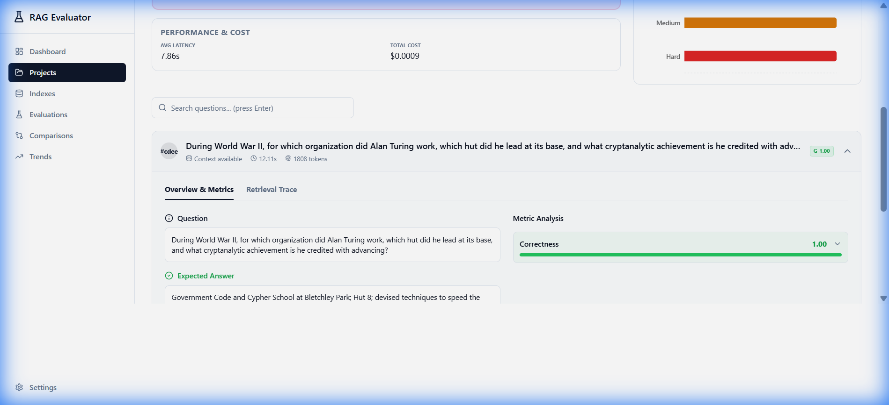
<!-- PLACEHOLDER: getting-started-per-case.png - Screenshot of per-case result detail view -->

Each result includes:
- **Question** asked
- **Generated Answer** from your RAG
- **Expected Answer** from your test set
- **Retrieved Context** (chunks used)
- **Individual Scores** for each metric
- **Explainability** - why the score was given

### Metric Explainability

Click "Why this score?" to understand the reasoning:

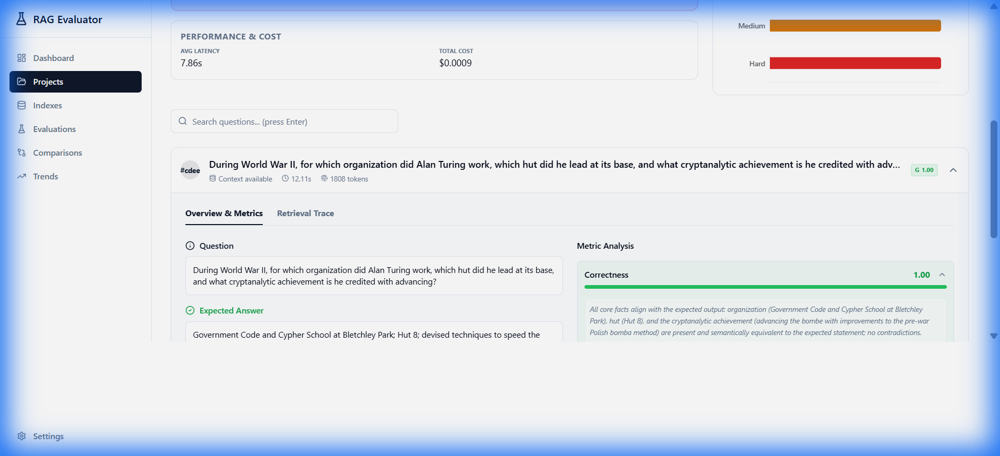
<!-- PLACEHOLDER: getting-started-explainability.png - Screenshot of metric explainability panel -->

The LLM judge explains:
- What it checked
- What it found
- Why it gave that score

### Retrieval Trace

For debugging, view the retrieval trace:

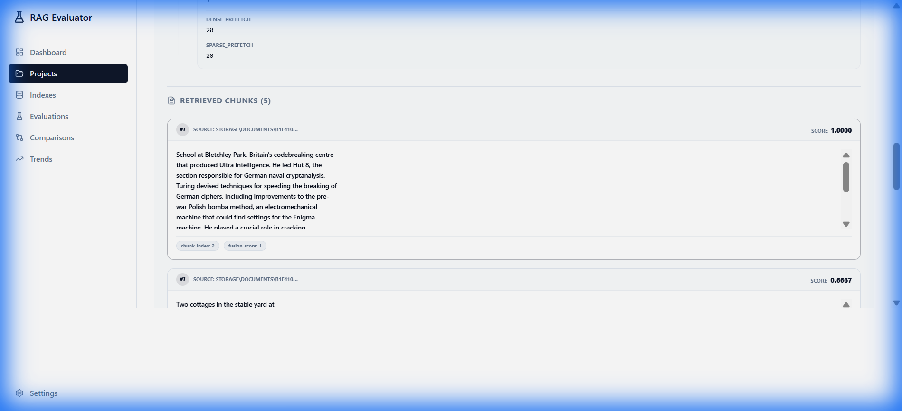
<!-- PLACEHOLDER: getting-started-retrieval-trace.png - Screenshot of retrieval trace viewer -->

This shows:
- Which chunks were retrieved
- Similarity scores
- Source documents
- Retrieval strategy used

---

## Next Steps

Congratulations! You've completed your first evaluation. Here's what to explore next:

### Improve Your RAG

| Problem | Solution | Guide |
|---------|----------|-------|
| Low Faithfulness | Check for hallucinations, improve prompts | [Metrics Guide](../metrics.md) |
| Low Precision | Tune chunk size, adjust top_k | [RAG Strategies](../rag_strategies.md) |
| Low Recall | Add more documents, try hybrid search | [RAG Strategies](../rag_strategies.md) |

### Try Different RAG Types

```bash
# Hybrid Search (semantic + keyword)
uv run rag-eval prepare --rag-type vector_hybrid --input-dir data/raw

# Graph RAG (knowledge graph)
uv run rag-eval prepare --rag-type graph_rag --input-dir data/raw

# Filesystem RAG (agentic)
uv run rag-eval prepare --rag-type filesystem_rag --input-dir data/raw
```

### Compare Implementations

Run evaluations on multiple RAG types and compare:

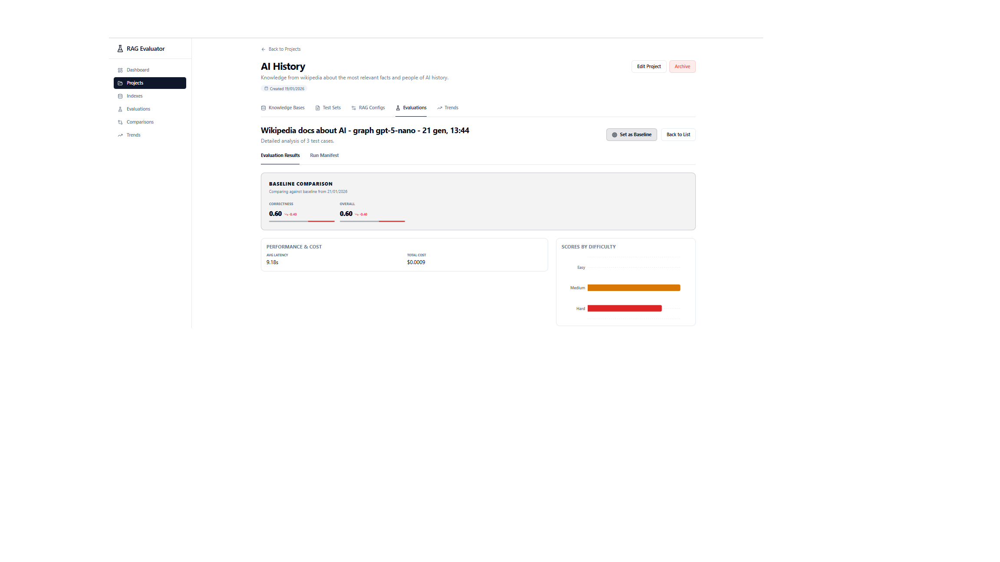
<!-- PLACEHOLDER: getting-started-comparison.png - Screenshot of comparison view -->

### Track Trends Over Time

Use the Trends view to monitor improvements:

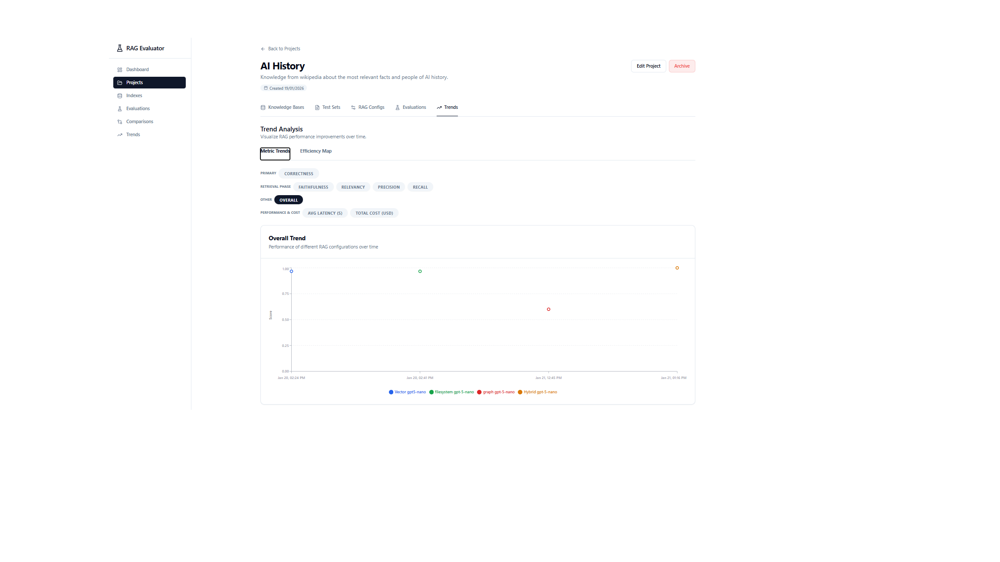
<!-- PLACEHOLDER: getting-started-trends.png - Screenshot of trends dashboard -->

---

## Common Issues

### "Connection refused" errors

Make sure Docker services are running:
```bash
docker-compose ps
```

All services should show "Up" status.

### "Invalid API key" errors

Verify your `.env` file has the correct key:
```bash
grep OPENAI_API_KEY .env
```

### Slow evaluations

- Reduce the number of metrics (start with just Faithfulness + Correctness)
- Set `DEEPEVAL_ASYNC_MODE=True` in `.env` for faster parallel evaluation
- Ensure you have sufficient API rate limits

### Need more help?

See the [Troubleshooting Guide](troubleshooting.md) for detailed solutions.

---

## Related Documentation

- [RAG Strategies Guide](../rag_strategies.md) - Deep dive into each RAG type
- [Evaluation Guide](evaluation-guide.md) - Advanced evaluation techniques
- [Metrics Guide](../metrics.md) - Understanding evaluation metrics
- [API Reference](../api.md) - For programmatic access
- [CLI Reference](../cli.md) - All CLI commands and options
